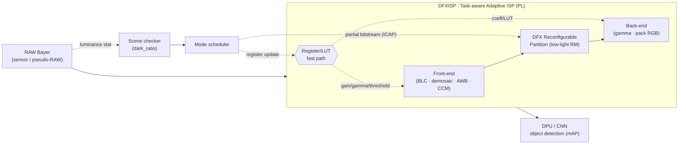
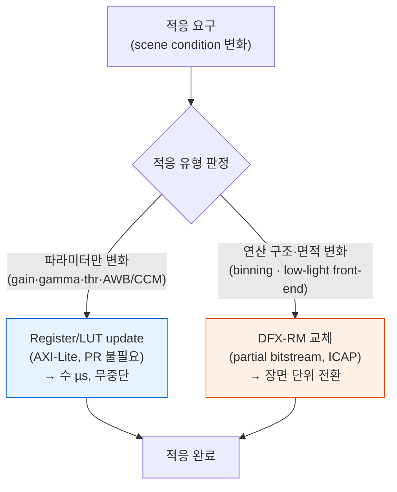
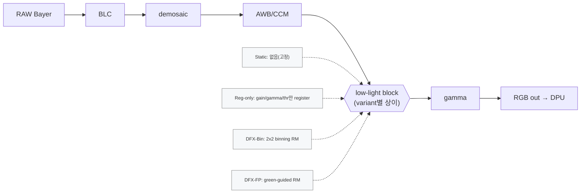
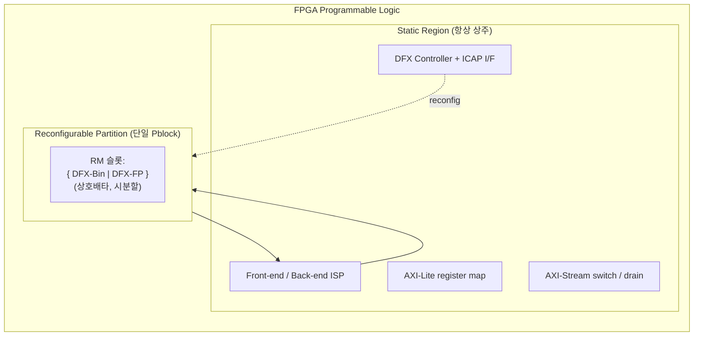
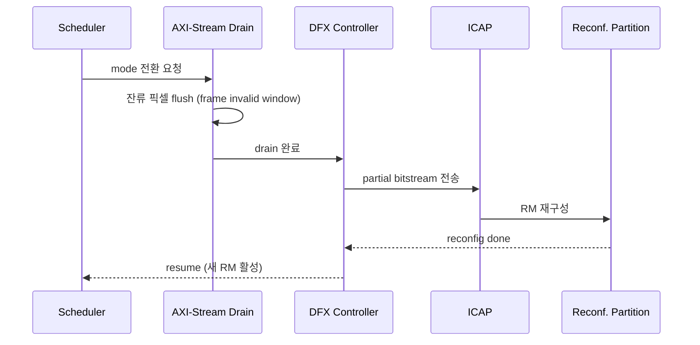
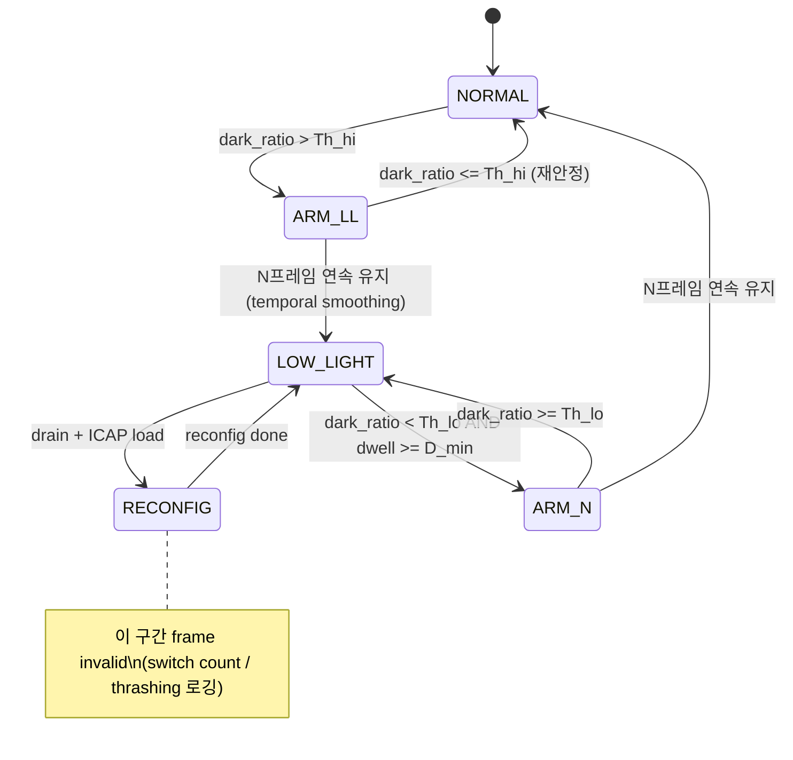

# 그림·표 (Figures & Tables)

> 작도 규약: 구조도는 아래 Mermaid 코드를 정본으로 두고, 최종 제출 시 동일 레이아웃을 vector(eps/pdf)로 재작도한다.
> 상태: **[작도완료]** 지금 확정 · **[빈 레이아웃]** ZCU104 실측 후 채움.

---

## Fig1 — 시스템 개요 [작도완료]
센서/pseudo-RAW → Task-aware ISP(2-path 적응) → DPU/CNN object detection.



## Fig2 — Hybrid register/DFX adaptation policy (기여 1) [작도완료]
무엇을 register로, 무엇을 DFX-RM으로 두는가.



## Fig3 — ISP 파이프라인과 4 variant 경로 [작도완료]



## Fig4 — RP / Pblock 플로어플랜 (개념) [작도완료]
흩어진 파라미터는 static, 연속된 low-light 연산만 단일 RP.



## Fig5 — DFX Controller 동작 흐름 [작도완료]



## Fig6 — DFX-aware mode scheduler FSM [작도완료]
hysteresis + temporal smoothing + minimum dwell + invalid window.



## Fig7 — 재구성 지연 모델 [빈 레이아웃 / 일부 모델식]
모델식(확정): `PR_latency ≈ partial_bitstream_size / ICAP_throughput`.
프레임 예산: 720p30 → 33.3 ms/frame. 장면 단위 전환이므로 PR_latency가 수~수십 ms여도 허용.
```
[ 막대그래프 자리 — x: {DFX-Bin, DFX-FP}, y: PR latency(ms),
  수평선: frame budget 33.3ms / scene dwell budget ]
데이터 출처: measurements/pr_latency.csv  ← ZCU104 실측 후 작성
```

## Fig8 — 결과: mAP–resource–power trade-off [빈 레이아웃]
```
[ 산점도/막대 자리 — variant별 (mAP vs LUT% vs Power) ]
데이터 출처: measurements/*.csv  ← ZCU104 실측 후 작성
```

---

# 표 (Tables)

## Tab1 — normal vs low-light adaptation delta (기여 1 근거) [정리완료]
출처: A1 분석 + repo PROJECT.md 파라미터. 값은 repo 인용값(설계 기본값)이며, 최종 캘리브레이션은 구현 시 확정.

| 항목 | Normal | Low-light | 적응 계층 | 비고 |
|---|---|---|---|---|
| BLC offset | 16 | 16 | 공유(고정) | 변화 없음 |
| Digital gain | ×256 (1.0) | ×320 (≈1.25 pre-gain) | **Register** | 빠른 적응 |
| Binning | off | 2×2 on (×1.5 등가) | **DFX (구조)** | 해상도/데이터패스 변화 |
| AWB (R/G/B) | 286/256/307 | 286/256/307 | Register/LUT | 계수 변화 |
| CCM | ×288 | ×288 | Register/LUT | 계수 변화 |
| Gamma (γ) | 2.2 | 4.0 | **Register/LUT** | 톤커브 LUT 교체 |
| Low-light front-end | bypass | enabled (RM) | **DFX (구조·면적)** | RP 교체 대상 |

→ 결론: 차이의 대부분은 register/LUT로 흡수 가능, **구조가 바뀌는 binning·low-light front-end만 DFX 정당화**.

## Tab2 — 관련연구 비교 (positioning) [작성완료]

| Cluster | 대표 연구 | 적응 방식 | 구현 형태 | 빠진 것 | DFXISP 기여 |
|---|---|---|---|---|---|
| Task-aware dynamic ISP | AdaptiveISP, DynamicISP, TA-ISP, POS-ISP | parameter/module/pipeline 선택 | software/GPU | FPGA PR cost·자원·partial bitstream 미고려 | register/DFX hybrid 적응 정책 |
| RAW/low-light detection | Dark-ISP, GenISP, SimROD, Beyond RGB, AODRaw | RAW→detection mAP 개선 | 대부분 neural/GPU, static | 하드웨어 자원 공유·runtime 교체 없음 | task-aware low-light RM on ZCU104 |
| Human low-light enhancement | SID, FPGA Retinex | 시각 품질(PSNR/SSIM) 또는 static FPGA | static accelerator | detection metric·adaptive scheduling 약함 | machine-vision mAP 중심 RM 평가 |
| FPGA/edge ISP | Vitis Vision, KV260, FOLD | 실시간 edge 구현 | static block/library | 동적 재구성 부재 | runtime reconfigurable ISP front-end |
| DPR/DFX systems | DPR signal/image, DPR CNN accel | runtime HW 유연성 | DFX/DPR | ISP/RAW machine-vision front-end 아님 | DFX-aware AI-ISP scheduler + evidence |

→ **빈자리:** "DFX 부분재구성으로 ISP 저조도 프런트엔드를 장면 단위 시분할 교체 + machine-vision mAP·HW evidence 동시 검증."

## Tab3 — 실험 variant matrix [작성완료]

| Variant | Adaptation | Low-light block | DFX? | 목적 |
|---|---|---|---|---|
| Static | 없음 | 없음(고정) | No | 최소 베이스라인 |
| Register-only | gain/gamma/threshold/LUT | resident or bypass | No | DFX 없는 적응의 한계 측정 |
| DFX-Bin | register + RM | 2×2 binning + gain + gamma | Yes | 구조적 적응 단순형(비교/fallback) |
| DFX-FP | register + RM | green-guided feature-preserving | Yes | **핵심 제안(novelty)** |

---

## Tab4a — 자원 사용 (Vitis HLS C-synth 추정, 실측)
출처: `results/resource_csynth.csv`, `reports/csynth/*_csynth.rpt`.
ZCU104 `xczu7ev-ffvc1156-2-e`, Vitis HLS 2024.1, clock target 5.0 ns (200 MHz).
가용: LUT 230,400 / FF 460,800 / DSP 1,728 / BRAM_18K 624.

| Metric | normal (base) | Reg-only | DFX-Bin | DFX-FP(ablation) |
|---|---|---|---|---|
| LUT (#, %) | 4,654 (2.0%) | 4,780 (2.1%) | 18,783 (8.2%) | 22,216 (9.6%) |
| FF (#, %)  | 3,537 (0.8%) | 3,564 (0.8%) | 16,183 (3.5%) | 24,372 (5.3%) |
| BRAM (#, %)| 3 (0.5%) | 3 (0.5%) | 4 (0.6%) | 4 (0.6%) |
| DSP (#, %) | 14 (0.8%) | 14 (0.8%) | 56 (3.2%) | 47 (2.7%) |
| Critical path / Fmax | 3.650 ns / 273.97 MHz | 3.650 ns / 273.97 MHz | 3.650 ns / 273.97 MHz | 3.650 ns / 273.97 MHz |
| Timing met? (5.0 ns) | ✅ | ✅ | ✅ | ✅ |

→ 네 variant 모두 동일 critical path(273.97 MHz)로 타이밍 충족 → **Fmax는 변별점이 아니며, 면적·전력이 DFX 가치 축(Direction A)**.

## Tab4b — DFX vs static-all-resident (csynth 기반 도출)
출처: `results/resource_dfx_savings.csv`. RM 증분 = variant − base(normal):
reg ΔLUT 126, bin ΔLUT 14,129, fp ΔLUT 17,562.

| 시나리오 | metric | static-all-resident | DFX(time-mux) | 절감 |
|---|---|---|---|---|
| 배치 2-RM (reg+bin) | LUT | 18,909 | 18,783 | **0.7%** (126) |
| 후보 3-RM (reg+bin+fp) | LUT | 36,471 | 22,216 | **39.1%** (14,255) |
| 후보 3-RM (reg+bin+fp) | DSP | 89 | 47 | **47.2%** (42) |
| 전력 proxy (주간/normal) | active-LUT | 18,909 | 4,780 | **74.7%** (binning datapath dark) |

→ **정직한 해석**: 최종 배치 2-RM에서 정적 면적 절감은 미미(0.7%, bin RM이 지배·reg RM은 거의 0). DFX 면적 이득은 **RM 라이브러리 규모에 비례**(3-RM에서 39% LUT/47% DSP). 현 RM 수에서 지배적 이득은 **면적이 아닌 전력**: binning datapath(≈fabric의 75%)가 주간엔 미구성/미클럭 → 동적 전력 제거. 상세: `results/10-hw-csynth-resource-2026-06-29.md`.

## Tab4c — 자원 사용 (Vivado post-route 실측) [빈 레이아웃 / ZCU104]
출처: `measurements/resource.csv`. Vivado implementation 후 채움 (csynth 추정 대비 검증).

| Metric | Static-all-resident | Reg-only | DFX-Bin | DFX-FP |
|---|---|---|---|---|
| LUT (#, %) | TODO(측정) | TODO(측정) | TODO(측정) | TODO(측정) |
| FF (#, %) | TODO(측정) | TODO(측정) | TODO(측정) | TODO(측정) |
| BRAM (#, %) | TODO(측정) | TODO(측정) | TODO(측정) | TODO(측정) |
| DSP (#, %) | TODO(측정) | TODO(측정) | TODO(측정) | TODO(측정) |
| Partial bitstream size | N/A | N/A | TODO(측정) | TODO(측정) |
| Fmax / timing met? | TODO(측정) | TODO(측정) | TODO(측정) | TODO(측정) |

## Tab5 — 전력·성능 [빈 레이아웃 / ZCU104 실측]
출처: `measurements/power_perf.csv`.

| Metric | Static | Reg-only | DFX-Bin | DFX-FP |
|---|---|---|---|---|
| Power (W) | TODO(측정) | TODO(측정) | TODO(측정) | TODO(측정) |
| FPS @720p | TODO(측정) | TODO(측정) | TODO(측정) | TODO(측정) |
| Throughput (MP/s) | TODO(측정) | TODO(측정) | TODO(측정) | TODO(측정) |
| Register update latency | N/A | TODO(측정) | TODO(측정) | TODO(측정) |
| PR latency (ms) | N/A | N/A | TODO(측정) | TODO(측정) |
| Frame stall during PR | N/A | N/A | TODO(측정) | TODO(측정) |

## Tab6 — machine-vision 정확도 [빈 레이아웃]
출처: `measurements/map.csv`. pseudo-RAW(COCO/ExDark) 평가. (소프트웨어 평가는 보드 불필요 — 가능 시 선행)

| Metric | Static | Reg-only | DFX-Bin | DFX-FP |
|---|---|---|---|---|
| mAP COCO pseudo-RAW | TODO(측정) | TODO(측정) | TODO(측정) | TODO(측정) |
| mAP ExDark pseudo-RAW | TODO(측정) | TODO(측정) | TODO(측정) | TODO(측정) |
| low-light subset AP | TODO(측정) | TODO(측정) | TODO(측정) | TODO(측정) |
| bit-exact golden mismatch | TODO(측정) | TODO(측정) | TODO(측정) | TODO(측정) |

## Tab7 — scheduler 안정성 [빈 레이아웃]
출처: `measurements/scheduler.csv`.

| Metric | baseline checker | +hysteresis | +temporal smoothing | +min dwell |
|---|---|---|---|---|
| mode mismatch rate | TODO(측정) | TODO(측정) | TODO(측정) | TODO(측정) |
| switch count / 1k frames | TODO(측정) | TODO(측정) | TODO(측정) | TODO(측정) |
| thrashing rate | TODO(측정) | TODO(측정) | TODO(측정) | TODO(측정) |
| skipped/invalid frames | TODO(측정) | TODO(측정) | TODO(측정) | TODO(측정) |

> 참고: repo baseline checker COCO 일치율 0.216 (A1 §4) — 개선 전 출발점.

## 작도/측정 상태 요약
- [작도완료] Fig1–Fig6, Tab1–Tab3 — 측정 불필요, 확정.
- [빈 레이아웃] Fig7·Fig8, Tab4·Tab5·Tab7 — ZCU104 실측 후. Tab6은 소프트웨어 평가로 선행 가능.
