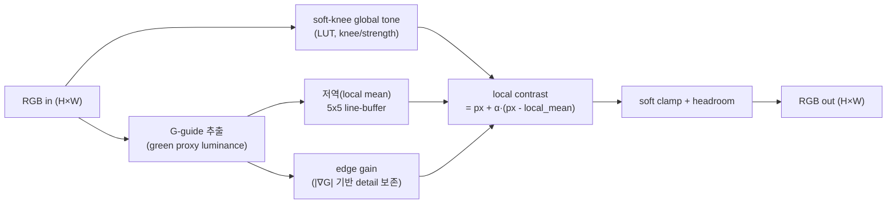

# DFX-RM 설계 사양 (DFX-Bin / DFX-FP)

> 목표: 4장 "구현"의 RM 레벨 사양을 확정해 HLS 착수 직전 상태로 만든다.
> 공통 원칙: RM은 상호배타(동시 비활성), 동일 RP(Pblock) 슬롯에 시분할 적재, 동일 입출력 ABI 유지.

> **방향 A 재편 노트 (2026-06-29):** RM의 평가 기준은 **mAP 향상이 아니라 자원/전력 절감 + mAP guardrail(≥ register-only)** 이다([08-e2-map-results]). 예비 실측에서 **DFX-FP(detail-boost)는 real-low-light mAP를 떨어뜨려 guardrail 탈락 → 본문에서는 ablation/부정사례**로 다룬다. DFX 1순위 후보는 "면적/전력이 크고 상호배타이며 mAP를 깎지 않는" 블록(예: binning, 경량 denoise)이다.

## 0. 공통 인터페이스 (RP 슬롯 ABI)
현재 C-sim top `dfxisp_accel`을 RP 경계로 분리한다. RM 슬롯은 다음 계약을 지킨다.

```cpp
// RP 슬롯 공통 시그니처 (DFX-Bin / DFX-FP 동일)
extern "C" void lowlight_rm(
    hls::stream<axis_px_t>& in_demosaiced,   // AWB/CCM 직후 RGB (front-end 출력)
    hls::stream<axis_px_t>& out_toned,       // gamma 직전 RGB (back-end 입력)
    const rm_params_t&      p                // AXI-Lite: gain, knee, strength, thr...
);
```

- **고정 ABI:** 입력=front-end 출력(H×W RGB), 출력=back-end 입력(H×W RGB). 출력 shape는 H×W로 고정(DPU-facing ABI 보존; latest.md 정책과 일치).
- **DFX-Bin의 H/2×W/2 binning**도 RP 내부에서 처리 후 **H×W로 복원(업샘플/replication)** 하여 슬롯 ABI를 깨지 않는다. (binning은 RM 내부의 SNR 향상 수단, 외부 shape 불변)
- 파라미터는 AXI-Lite register(`rm_params_t`)로 주입 → register-fast path와 정합.

## 1. DFX-Bin RM (baseline / fallback)
### 1.1 알고리즘
1. 2×2 binning: RGB 2×2 평균 → 노이즈 √4=2배 SNR 향상, H/2×W/2.
2. digital gain (pre-gain ×1.25 등가) + 저조도 lift.
3. soft clamp(헤드룸 보존) → 업샘플(nearest/replicate) → H×W 복원.
### 1.2 특성
- 강점: 구현 단순, 결정적, SNR↑. C-sim에 이미 유사 경로 존재(검증 빠름).
- 약점: 유효 해상도 손실 → 원거리/소형 객체 mAP 하락 리스크.
### 1.3 자원 성향(정성): 적음(평균+게인+LUT). 실측 [TODO:측정].

## 2. DFX-FP RM (핵심 제안 — green-guided feature-preserving)
SimROD 계열의 global tone + green-channel guided local enhancement를 **non-binning**으로 HW 네이티브 재설계.
### 2.1 파이프라인

### 2.2 핵심 연산 정의
- **soft-knee global tone:** 저조도 lift를 어두운 영역에 집중, 하이라이트는 knee로 압축 → clipping 억제. LUT(256/1024 entry)로 구현, AXI-Lite로 LUT 교체.
- **green-guided local contrast:** `out = in + α·(in − blur_G(in))`. green proxy를 guide로 사용해 색잡음 증폭 억제. `α`(strength)는 register.
- **edge-aware detail:** `|∇G|`가 큰 화소는 local enhancement를 줄여 halo/노이즈 증폭 방지(feature 보존 핵심).
- 모두 **고정소수점(Q-format)** , line-buffer 기반 5×5 윈도우(스트리밍, II=1 목표).
### 2.3 특성
- 강점: 해상도 보존 → detection feature 유지, mAP 유리(가설). novelty 핵심.
- 약점: 튜닝 파라미터(knee/strength/α) 많음, 자원 DFX-Bin보다 큼 → RP 면적·timing이 핵심 리스크.
### 2.4 자원 성향(정성): line-buffer(BRAM)+곱셈(DSP) 증가. RP Pblock 초과 시 윈도우 축소(5×5→3×3)·strength 단계 축소로 fallback. 실측 [TODO:측정].

## 3. Golden model (bit-exact 기준)
- Python 참조 모델을 정본으로, HLS C-sim과 RGB888/RGB32 bit-exact 비교(기존 832px/7케이스 프레임워크 확장).
- DFX-FP용 골든 케이스 추가: (a) 어두운 평탄부(노이즈 lift) (b) 저조도 에지(detail 보존) (c) 하이라이트(knee clipping 억제) (d) threshold 경계.
- 고정소수점 라운딩 규칙을 Python·HLS 동일하게 정의(±0 mismatch 목표).

## 4. HLS 구현·검증 계획 (보드 직전까지)
| 단계 | 산출물 | 도구 | 보드 필요? |
|---|---|---|---|
| S1 RP 경계 분리 | `lowlight_rm` 슬롯 추출, top 재구성 | g++ C-sim | No |
| S2 DFX-Bin RM | C-sim + golden 통과 | g++ | No |
| S3 DFX-FP RM | green-guided RM C-sim + 확장 golden 통과 | g++ | No |
| S4 HLS csynth | II/latency/자원 추정 리포트 | **Vitis HLS** | No(툴 필요) |
| S5 HLS cosim | RTL 동작 검증 | **Vitis HLS** | No(툴 필요) |
| S6 RP/Pblock + DFX flow | 부분 비트스트림 2종 | **Vivado** | No(툴 필요) |
| S7 보드 측정 | 자원/전력/PR latency/mAP | **ZCU104** | **Yes ← 여기부터 빈 레이아웃** |

- S1~S3는 본 환경에서 진행 가능(C-sim). S4~S6은 Vitis/Vivado 설치 워크스테이션 필요(수치=TODO:측정).
- S7이 "실측 직전" 경계. S7 입력 템플릿은 `05-experiment-protocol.md` + `measurements/*.csv`.

## 5. 리스크와 완화
| 리스크 | 영향 | 완화 |
|---|---|---|
| DFX-FP가 RP Pblock 초과 | 라우팅 실패 | 윈도우 3×3, strength 단계 축소, BRAM 재사용 |
| PR latency가 dwell 예산 초과 | 전환 중 frame drop | bitstream 압축, 장면 단위 dwell↑, DFX-Bin로 fallback |
| green-guide 색잡음 증폭 | mAP 저하 | edge-aware gating, headroom clamp |
| 고정소수점 mismatch | golden 실패 | Q-format·라운딩 Python/HLS 통일 |
