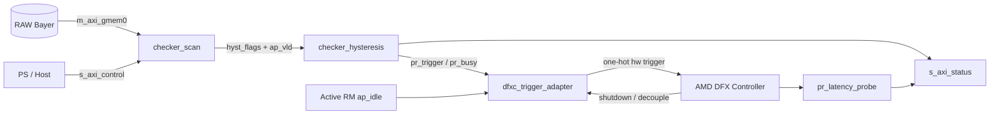

# Checker Interface and Module Hierarchy

작성일: 2026-08-14
HLS measurement top: `checker_scan`
통합 wrapper: `checker_ip`
정적 제어 계층: `checker_hysteresis`, `dfxc_trigger_adapter`, `pr_latency_probe`

## Overview

Checker subsystem은 RAW 프레임에서 임계값보다 어두운 픽셀 수를 측정하고,
single-frame mode와 Schmitt-band flag를 만든 뒤, 안정화된 mode transition을 AMD
DFX Controller hardware trigger로 변환한다.



전체 wrapper 계층은 다음과 같다.

```text
checker_ip
├── u_scan: checker_scan                    Vitis HLS generated
├── u_hyst: checker_hysteresis              stable mode / Schmitt FSM
├── u_adapter: dfxc_trigger_adapter         PG374 trigger/shutdown bridge
├── u_probe: pr_latency_probe               drain/swap cycle counters
├── frame_cnt, swap_cnt                     status counters
└── s_axi_status read-only register slave   observability
```

## 1. `checker_scan` source interface

```cpp
extern "C" void checker_scan(
    const uint16_t* raw_bayer,
    int width, int height, int mode,
    uint16_t dark_pixel_threshold,
    int verdict_pct, int enter_pct, int exit_pct,
    int* selected_mode, int* hyst_flags, int* dark_count);
```

| 인자 | 방향 | 타입 | 의미 |
|---|---|---|---|
| `raw_bayer` | in | `const uint16_t*` | RAW12 frame |
| `width`, `height` | in | `int` | frame dimensions |
| `mode` | in | `int` | forced NORMAL, forced LOW_LIGHT, 또는 AUTO |
| `dark_pixel_threshold` | in | `uint16_t` | dark 판정 RAW level |
| `verdict_pct` | in | `int` | single-frame mode threshold, 기본 정책 62% |
| `enter_pct` | in | `int` | LOW_LIGHT 진입 edge, 기본 64% |
| `exit_pct` | in | `int` | NORMAL 복귀 edge, 기본 60% |
| `selected_mode` | out | `int*` | single-frame verdict |
| `hyst_flags` | out | `int*` | bit0 above-enter, bit1 below-exit |
| `dark_count` | out | `int*` | threshold 미만 pixel 수 |

invalid pointer/dimension에서는 NORMAL, below-exit flag, dark count 0을 반환한다.

## 2. `checker_scan` Vitis HLS RTL ports

근거: `results/checker_validation_2026-08-06/checker_scan_csynth_2026-08-06.rpt`.

### 2.1 Interface groups

| 그룹 | 폭·프로토콜 | 역할 |
|---|---|---|
| `s_axi_control` | address 7-bit, data 32-bit AXI4-Lite slave | 포인터, policy, output register, start/done |
| `m_axi_gmem0` | address 64-bit, data 32-bit full AXI4 master | RAW frame read |
| `ap_clk` | in 1 | HLS clock |
| `ap_rst_n` | in 1 | active-low reset |
| `interrupt` | out 1 | HLS control interrupt |
| `hyst_flags` | out 32 | Schmitt comparison result |
| `hyst_flags_ap_vld` | out 1 | flags valid pulse, frame마다 1회 |

`hyst_flags`만 `ap_vld` wire pair로 직접 노출된다. `selected_mode`와
`dark_count`는 AXI4-Lite read-back register이며, fabric의 hysteresis FSM은
이 느린 register path가 아니라 `hyst_flags_ap_vld` pulse를 사용한다.

### 2.2 AXI4-Lite signal set

| Channel | Inputs | Outputs |
|---|---|---|
| AW | `AWVALID`, `AWADDR[6:0]` | `AWREADY` |
| W | `WVALID`, `WDATA[31:0]`, `WSTRB[3:0]` | `WREADY` |
| B | `BREADY` | `BVALID`, `BRESP[1:0]` |
| AR | `ARVALID`, `ARADDR[6:0]` | `ARREADY` |
| R | `RREADY` | `RVALID`, `RDATA[31:0]`, `RRESP[1:0]` |

모든 이름에는 `s_axi_control_` 접두사가 붙는다. 정확한 argument register byte
offset은 generated `checker_scan_control_s_axi.v` 또는 driver header를 기준으로
확정해야 한다.

### 2.3 `m_axi_gmem0`

full AXI4 signal set은 `AW/W/B/AR/R` 채널을 모두 포함한다. 주요 폭은 address
64, data 32, strobe 4, burst length 8, size 3, burst 2, response 2, ID/USER 1이다.
Checker는 의미상 RAW read만 수행하지만 Vitis template 때문에 write channel도
top port에 존재한다.

## 3. Measurement hierarchy

```text
checker_scan
└── checker_select_mode
    ├── forced-mode bypass
    ├── dark scan loop: raw[i] < dark_pixel_threshold
    ├── dark_pct100 = dark_count × 100
    ├── above_enter = dark_pct100 > enter_pct × pixel_count
    ├── below_exit = dark_pct100 < exit_pct × pixel_count
    └── selected_mode = dark_pct100 > verdict_pct × pixel_count
```

Checker core는 stateless다. 프레임 간 stable mode와 dwell은 다음 RTL 계층이
담당한다.

## 4. `checker_hysteresis`

### 4.1 Ports

| 포트 | 방향 | 폭 | 의미 |
|---|---|---:|---|
| `clk` | in | 1 | static-region clock |
| `rst_n` | in | 1 | active-low reset, NORMAL로 초기화 |
| `flags_vld` | in | 1 | completed-frame flag pulse |
| `above_enter` | in | 1 | dark ratio > enter threshold |
| `below_exit` | in | 1 | dark ratio < exit threshold |
| `pr_busy` | in | 1 | DFX request accepted/in progress |
| `pr_trigger` | out reg | 1 | request, busy 관찰까지 유지 |
| `mode` | out reg | 1 | 0 NORMAL, 1 LOW_LIGHT |

parameter `DWELL_FRAMES`의 기본값은 1이다. mode 전환 후 지정 프레임 동안 반대
전환을 막으며 pending/busy 프레임은 dwell에 포함하지 않는다. 두 flag가 모두
0인 Schmitt band 안에서는 mode를 유지한다.

## 5. `dfxc_trigger_adapter`

| 포트 | 방향 | 폭 | 연결 |
|---|---|---:|---|
| `clk`, `rst_n` | in | 1 | static clock/reset |
| `mode` | in | 1 | hysteresis target mode |
| `pr_trigger` | in | 1 | hysteresis request |
| `pr_busy` | out | 1 | `shutdown_req OR decouple` |
| `vs_hw_triggers` | out reg | 2 | bit0 NORMAL, bit1 LOW_LIGHT one-hot |
| `vs_rm_shutdown_req` | in | 1 | DFX Controller drain request |
| `vs_rm_shutdown_ack` | out | 1 | `shutdown_req AND rm_ap_idle` |
| `vs_rm_decouple` | in | 1 | RP boundary isolation state |
| `rm_ap_idle` | in | 1 | active RM drained/idle |

`vs_hw_triggers`는 request가 있고 IP가 아직 busy가 아닐 때 target mode에 해당하는
one-hot pulse를 만든다. 실제 PG374 VSM 계약은 Vivado 2024.1 generated IP에서
`vsm_VS_0_hw_triggers[1:0]`와 shutdown/decouple 포트로 확인됐다.

## 6. `pr_latency_probe`

| 포트 | 방향 | 폭 | 의미 |
|---|---|---:|---|
| `trigger_seen` | in | 1 | swap measurement 시작 |
| `vs_rm_shutdown_req/ack` | in | 1 each | drain interval boundary |
| `vs_rm_decouple` | in | 1 | swap interval boundary |
| `drain_cycles` | out reg | 32 | shutdown request→ack cycles |
| `swap_cycles` | out reg | 32 | trigger→decouple release cycles |
| `meas_valid` | out reg | 1 | 새 measurement 완료 pulse |

latency probe는 관찰 전용이며 trigger 결정 경로에 들어가지 않는다.

## 7. `checker_ip` wrapper ports

### 7.1 External groups

| 그룹 | 포트/폭 | 역할 |
|---|---|---|
| clock/reset | `aclk`, `aresetn` | 전체 checker subsystem clock/reset |
| HLS control | `s_axi_control_*`, addr 7/data 32 | `checker_scan`에 direct pass-through |
| HLS interrupt | `checker_interrupt` 1-bit | scan completion interrupt |
| RAW memory | `m_axi_gmem0_*`, addr 64/data 32 | SmartConnect/DDR pass-through |
| status | `s_axi_status_*`, addr 6/data 32 | read-only observability slave |
| DFX VSM | `vs_hw_triggers[1:0]`, shutdown req/ack, decouple | AMD DFX Controller boundary |
| active RM | `rm_ap_idle` | safe shutdown condition |

### 7.2 Read-only status map

| Offset | Register | 폭 | 의미 |
|---:|---|---:|---|
| `0x00` | `stable_mode` | bit 0 | current hysteresis mode |
| `0x04` | `frame_cnt` | 32 | received `hyst_flags_ap_vld` count |
| `0x08` | `swap_cnt` | 32 | completed latency measurement count |
| `0x0C` | `drain_cycles` | 32 | most recent drain latency |
| `0x10` | `swap_cycles` | 32 | most recent swap latency |

status writes are consumed and answered with `SLVERR` (`BRESP=2'b10`) without
changing state. Reads return `OKAY` (`RRESP=2'b00`), one outstanding read at a
time.

## 8. End-to-end sequencing

1. PS writes RAW address, frame size, mode/policy values through `s_axi_control`.
2. `checker_scan` reads RAW using `m_axi_gmem0`, counts dark pixels and publishes
   output registers plus `hyst_flags/hyst_flags_ap_vld`.
3. `checker_hysteresis` consumes the pulse and changes stable mode only across
   the 64%/60% Schmitt edges after dwell.
4. It holds `pr_trigger` until the adapter reports `pr_busy`.
5. Adapter drives the target one-hot DFX hardware trigger.
6. On shutdown request it waits for `rm_ap_idle`, then asserts shutdown ack.
7. DFX Controller decouples and swaps the RP; the latency probe measures the
   observable handshake interval.
8. Status registers expose stable mode and counters to software.

## 9. Verification and limitations

| 항목 | 상태 | 근거 |
|---|---|---|
| `checker_scan` C-sim/cosim | PASS | checker validation results |
| `checker_scan` csynth port list | 확인 | `checker_scan_csynth_2026-08-06.rpt` |
| hysteresis unit simulation | PASS | `checker_hysteresis_tb.v` |
| wrapper integration simulation | PASS | `checker_ip_tb.v` |
| adapter contract simulation | PASS | `checker_to_dfxc_tb.v` behavioral model |
| PG374 key port names/widths | 확인 | Vivado generated instantiation probe |
| generated DFX Controller netlist integration | 미실시 | behavioral contract model만 검증 |
| RM reset wiring/per-RM shutdown config | 미완료 | Block Design/IP GUI 단계 필요 |
| exact HLS control byte offsets | 미확인 | generated driver/header 기준 필요 |

## 10. References

- `src/checker.cpp`
- `include/checker.hpp`
- `checker/checker_ip.v`
- `checker/checker_hysteresis.v`, `checker/checker_hysteresis.md`
- `checker/dfxc_trigger_adapter.v`, `checker/dfxc_adapter.md`
- `checker/pr_latency_probe.v`
- `results/checker_validation_2026-08-06/checker_scan_csynth_2026-08-06.rpt`
- `results/HW-INTERFACE-PIN-MODULE-PROTOCOL-2026-08-03.md`
