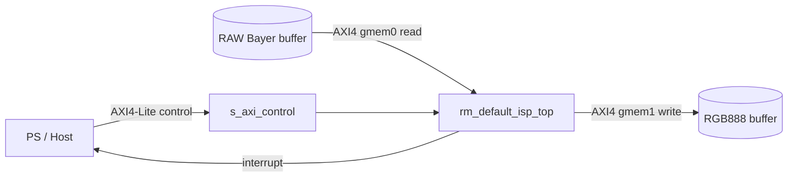

# default_ISP Interface and Module Hierarchy

작성일: 2026-08-14
대상: `src/default_isp.cpp`, `include/default_isp.hpp`
배포 후보 top: `rm_default_isp_top`
개발·분석 top: `default_isp`

## Overview

`default_ISP`는 RAW12 RGGB 프레임을 RGB888로 변환하는 shape-preserving ISP
파이프라인이다. 소스 수준의 처리 순서는 다음과 같다.

```text
RAW12 RGGB
  -> black-level correction
  -> Bayer-site gain control
  -> RGGB bilinear demosaic
  -> gray-world AWB (default_isp에서 on/bypass 선택)
  -> 3x3 Q8 color-correction matrix
  -> 12-bit to 8-bit quantization
  -> gamma 2.0 LUT
  -> packed RGB888 (0x00RRGGBB)
```

두 개의 C top이 존재한다.

| Top | 목적 | 인자 수 | AWB | DFX RP 계약 |
|---|---|---:|---|---|
| `default_isp` | 개발·분석 | 7 | 런타임 `awb_mode` | 다른 RM과 포트 수가 다름 |
| `rm_default_isp_top` | 배포 후보 RM | 6 | 항상 ON | `rm_normal_tone_top`, `rm_low_light_tone_top`과 타입·순서·개수 동일 |

배포 기준 Vitis HLS 구조는 세 종류의 외부 인터페이스로 나뉜다.



- `s_axi_control`: 시작·완료 제어, 포인터 주소, `width`/`height`, 출력 크기
  read-back을 담당한다.
- `m_axi_gmem0`: `raw_bayer` 프레임을 읽는 AXI4 master이다.
- `m_axi_gmem1`: `rgb_out` 프레임을 쓰는 AXI4 master이다.
- `ap_clk`, `ap_rst_n`, `interrupt`: 클럭·리셋·완료 알림을 담당한다.

> **결과 구분:** 이 문서의 Vitis HLS 포트는
> `reports/csynth/rm_default_isp_top_csynth.rpt`의 실측 결과다. 아래의 Bambu
> 계층은 내부 datapath를 관찰하기 위해 Xilinx 전용 pragma를 제거한
> `figure/default_isp_bambu.cpp`에서 생성했다. Bambu 포트를 실제 Vitis IP의
> AXI 포트로 해석하면 안 된다.

## 1. Source-level interface

### 1.1 `default_isp`

```cpp
extern "C" void default_isp(
    const uint16_t* raw_bayer,
    uint32_t* rgb_out,
    int width,
    int height,
    int awb_mode,
    int* out_width,
    int* out_height);
```

| 인자 | C 방향 | 타입 | 단위·형식 | 의미 |
|---|---|---|---|---|
| `raw_bayer` | in | `const uint16_t*` | `width*height` words, 유효값 12-bit | RGGB Bayer 입력 프레임 |
| `rgb_out` | out | `uint32_t*` | `width*height` words | `0x00RRGGBB` RGB888 출력 프레임 |
| `width` | in | `int` | pixels | 입력 너비 |
| `height` | in | `int` | pixels | 입력 높이 |
| `awb_mode` | in | `int` | `0` 또는 `1` | `0`: AWB bypass, `1`: adaptive gray-world AWB |
| `out_width` | out | `int*` | pixels | 정상 입력이면 `width`와 동일 |
| `out_height` | out | `int*` | pixels | 정상 입력이면 `height`와 동일 |

잘못된 포인터 또는 `width <= 0`, `height <= 0`이면 출력 크기를 0으로 설정하고
처리를 종료한다.

### 1.2 `rm_default_isp_top`

```cpp
extern "C" void rm_default_isp_top(
    const uint16_t* raw_bayer,
    uint32_t* rgb_out,
    int width,
    int height,
    int* out_width,
    int* out_height);
```

`awb_mode`가 외부에 노출되지 않으며 내부적으로 `DEFAULT_ISP_AWB_ON`을 사용한다.
이 6개 인자 서명은 다른 tone RM top과 동일한 DFX 경계 계약이다.

### 1.3 HLS pragma mapping

| C 객체 | HLS pragma | Vitis 인터페이스 | 역할 |
|---|---|---|---|
| `raw_bayer` | `m_axi offset=slave bundle=gmem0 depth=2048` | AXI4 master + control pointer register | 프레임 burst read |
| `rgb_out` | `m_axi offset=slave bundle=gmem1 depth=2048` | AXI4 master + control pointer register | 프레임 burst write |
| `width`, `height` | `s_axilite bundle=control` | AXI4-Lite register | 입력 크기 |
| `out_width`, `out_height` | `s_axilite bundle=control` | AXI4-Lite read-back register | 출력 크기 |
| `return` | `s_axilite bundle=control` | `ap_ctrl_hs` control register | start/done/idle/ready |
| `awb_mode` | `s_axilite bundle=control` | AXI4-Lite register | 개발 top에만 존재 |

## 2. Vitis HLS RTL interface: `rm_default_isp_top`

근거는 Vitis HLS 2024.1, part `xczu7ev-ffvc1156-2-e`, target clock 5.0 ns로
생성된 `reports/csynth/rm_default_isp_top_csynth.rpt`이다.

### 2.1 Clock, reset, and control

| RTL 포트 | 방향 | 폭 | 프로토콜 | 의미 |
|---|---|---:|---|---|
| `ap_clk` | in | 1 | `ap_ctrl_hs` | IP 클럭 |
| `ap_rst_n` | in | 1 | `ap_ctrl_hs` | active-low 리셋 |
| `interrupt` | out | 1 | `ap_ctrl_hs` | 완료/준비 interrupt 출력 |

`ap_start`, `ap_done`, `ap_idle`, `ap_ready`는 독립 top pin이 아니라
`s_axi_control` 레지스터 인터페이스를 통해 접근한다.

### 2.2 AXI4-Lite `s_axi_control`

| 채널 | 포트 | 방향 | 폭 |
|---|---|---|---:|
| Write address | `AWVALID`, `AWADDR` | in | 1, 7 |
| Write address | `AWREADY` | out | 1 |
| Write data | `WVALID`, `WDATA`, `WSTRB` | in | 1, 32, 4 |
| Write data | `WREADY` | out | 1 |
| Write response | `BREADY` | in | 1 |
| Write response | `BVALID`, `BRESP` | out | 1, 2 |
| Read address | `ARVALID`, `ARADDR` | in | 1, 7 |
| Read address | `ARREADY` | out | 1 |
| Read data | `RREADY` | in | 1 |
| Read data | `RVALID`, `RDATA`, `RRESP` | out | 1, 32, 2 |

실제 포트에는 모두 `s_axi_control_` 접두사가 붙는다. 주소 폭이 7-bit이므로
노출된 control address space는 128 bytes다. 다만 현재 저장소에는 생성된
`*_control_s_axi.v` 또는 `*_hw.h`가 없으므로 개별 인자의 정확한 바이트
오프셋은 이 문서에서 확정하지 않는다.

논리적으로 control register가 담는 값은 다음과 같다.

- `raw_bayer` base address: 64-bit, low/high 32-bit word
- `rgb_out` base address: 64-bit, low/high 32-bit word
- `width`, `height`: 각각 32-bit
- `out_width`, `out_height`: 각각 32-bit read-back value와 valid 상태
- control/interrupt: `ap_start`, `ap_done`, `ap_idle`, `ap_ready`, GIER,
  IP_IER, IP_ISR

### 2.3 AXI4 master bundles

`gmem0`과 `gmem1`은 같은 포트 폭을 갖는 full AXI4 master bundle이다. 실제
포트명은 `m_axi_gmem0_<signal>` 또는 `m_axi_gmem1_<signal>`이다.

| AXI 채널 | Signal | Master 기준 방향 | 폭 |
|---|---|---|---:|
| AW | `AWVALID` | out | 1 |
| AW | `AWREADY` | in | 1 |
| AW | `AWADDR` | out | 64 |
| AW | `AWID` | out | 1 |
| AW | `AWLEN` | out | 8 |
| AW | `AWSIZE` | out | 3 |
| AW | `AWBURST` | out | 2 |
| AW | `AWLOCK` | out | 2 |
| AW | `AWCACHE` | out | 4 |
| AW | `AWPROT` | out | 3 |
| AW | `AWQOS` | out | 4 |
| AW | `AWREGION` | out | 4 |
| AW | `AWUSER` | out | 1 |
| W | `WVALID` | out | 1 |
| W | `WREADY` | in | 1 |
| W | `WDATA` | out | 32 |
| W | `WSTRB` | out | 4 |
| W | `WLAST`, `WID`, `WUSER` | out | 1 each |
| B | `BVALID` | in | 1 |
| B | `BREADY` | out | 1 |
| B | `BRESP` | in | 2 |
| B | `BID`, `BUSER` | in | 1 each |
| AR | `ARVALID` | out | 1 |
| AR | `ARREADY` | in | 1 |
| AR | `ARADDR` | out | 64 |
| AR | `ARID` | out | 1 |
| AR | `ARLEN` | out | 8 |
| AR | `ARSIZE` | out | 3 |
| AR | `ARBURST` | out | 2 |
| AR | `ARLOCK` | out | 2 |
| AR | `ARCACHE` | out | 4 |
| AR | `ARPROT` | out | 3 |
| AR | `ARQOS` | out | 4 |
| AR | `ARREGION` | out | 4 |
| AR | `ARUSER` | out | 1 |
| R | `RVALID` | in | 1 |
| R | `RREADY` | out | 1 |
| R | `RDATA` | in | 32 |
| R | `RLAST`, `RID`, `RUSER` | in | 1 each |
| R | `RRESP` | in | 2 |

의도상 `gmem0`은 `raw_bayer` read가 주 기능이고 `gmem1`은 `rgb_out` write가
주 기능이다. Vitis가 full AXI master template을 생성하므로 리포트에는 사용
방향과 무관한 AW/W/B 또는 AR/R 채널도 모두 나타난다.

## 3. Module hierarchy

### 3.1 Semantic source hierarchy

```text
default_isp / rm_default_isp_top
└── run_default_isp
    ├── pass 1: BLC + Bayer gain + demosaic statistics
    ├── AWB gain calculation
    │   ├── unsigned division helper
    │   └── clamp to configured gain range
    └── pass 2: demosaic + AWB + CCM + gamma + RGB pack
        ├── sample_raw12
        ├── corrected_bayer
        ├── demosaic_channel
        ├── clamp_i
        ├── ccm_channel
        ├── quantize_gamma
        └── pack_rgb
```

대부분의 helper는 `static inline` 또는 anonymous namespace 함수라 HLS 결과에서
독립 RTL 모듈 이름으로 보존되지 않고 main datapath에 인라인된다.

### 3.2 Bambu-generated RTL hierarchy

내부 구조 관찰용 RTL의 실제 계층은 다음과 같다.

```text
default_isp                         minimal memory-interface wrapper
└── _default_isp                    function core
    ├── Controller_i
    │   └── controller_default_isp  FSM, mux select, register write-enable
    ├── Datapath_i
    │   └── datapath_default_isp    arithmetic, registers, memories, address logic
    │       ├── __divsi3            signed 32-bit division helper
    │       │   ├── controller___divsi3
    │       │   └── datapath___divsi3
    │       ├── __udivdi3           unsigned 64-bit division helper
    │       │   ├── controller___udivdi3
    │       │   └── datapath___udivdi3
    │       ├── BMEMORY_CTRLN        external pointer memory controller
    │       ├── ARRAY_1D_STD_BRAM_* internal constant/table storage
    │       ├── ARRAY_1D_STD_DISTRAM_*
    │       ├── register_SE / register_STD
    │       └── arithmetic and mux functional units
    └── done_delayed_REG            registered completion output
```

### 3.3 `default_isp`: minimal wrapper

| 포트 그룹 | 포트 | 방향 | 폭 | 의미 |
|---|---|---|---:|---|
| control | `clock`, `reset`, `start_port` | in | 1 each | 실행 제어 |
| arguments | `raw_bayer`, `rgb_out` | in | 32 each | Bambu memory address representation |
| arguments | `width`, `height`, `awb_mode` | in | 32 each | scalar input |
| arguments | `out_width`, `out_height` | in | 32 each | output pointer address representation |
| memory response | `M_Rdata_ram` | in | 64 | external memory read data, two lanes |
| memory response | `M_DataRdy` | in | 2 | per-lane read ready |
| completion | `done_port` | out | 1 | registered operation completion |
| memory request | `Mout_oe_ram`, `Mout_we_ram` | out | 2 each | per-lane read/write enables |
| memory request | `Mout_addr_ram` | out | 64 | two 32-bit addresses |
| memory request | `Mout_Wdata_ram` | out | 64 | two 32-bit write words |
| memory request | `Mout_data_ram_size` | out | 12 | two 6-bit transfer-size fields |

이 wrapper는 `_default_isp`의 slave-side memory 요청을 내부 master-side 응답에
loop-back하고, 외부 memory bus를 core에 연결한다. `Min_*` 입력은 0으로 묶는다.

### 3.4 `_default_isp`: core boundary

`_default_isp`는 wrapper 인자와 memory bus를 받아 controller와 datapath를
결합한다.

| 경계 | 대표 신호 | 폭 | 설명 |
|---|---|---:|---|
| lifecycle | `clock`, `reset`, `start_port`, `done_port` | 1 | 실행 handshake |
| argument | `raw_bayer`, `rgb_out`, `width`, `height`, `awb_mode`, `out_width`, `out_height` | 32 each | 함수 인자/포인터 주소 |
| slave request | `S_oe_ram`, `S_we_ram` | 2 each | 내부 slave read/write enable |
| slave request | `S_addr_ram`, `S_Wdata_ram` | 64 each | 내부 address/write data |
| slave request | `S_data_ram_size` | 12 | transfer size |
| master response | `M_Rdata_ram` | 64 | memory read data |
| master response | `M_DataRdy` | 2 | data ready |
| slave response | `Sout_Rdata_ram` | 64 | loop-back read response |
| slave response | `Sout_DataRdy` | 2 | loop-back ready |
| master request | `Mout_oe_ram`, `Mout_we_ram` | 2 each | outgoing memory operation |
| master request | `Mout_addr_ram`, `Mout_Wdata_ram` | 64 each | outgoing address/write data |
| master request | `Mout_data_ram_size` | 12 | outgoing transfer size |

내부 연결은 다음 세 종류로 나뉜다.

- datapath → controller: 14개 `OUT_CONDITION_*`, 3개 `OUT_MULTIIF_*`, 6개
  `OUT_UNBOUNDED_*` 상태 신호
- controller → datapath: memory functional-unit selector 16개, mux selector
  66개, register write-enable 143개
- datapath ↔ memory: `S*`, `M*`, `Sin*`, `Min*`, `Sout*`, `Mout*` 버스

### 3.5 `controller_default_isp`

controller는 데이터 연산을 수행하지 않고 다음 제어 신호를 만든다.

| 신호군 | 개수 | 역할 |
|---|---:|---|
| `fuselector_*_LOAD/STORE` | 16 | BRAM/DISTRAM/external memory access 기능 선택 |
| `selector_IN_UNBOUNDED_*` | 6 | 가변 지연 연산 start/select |
| `selector_MUX_*` | 66 | datapath operand 및 결과 mux 선택 |
| `wrenable_reg_*` | 143 | 상태·중간값 register write enable |
| `done_port` | 1 | core 수행 완료 |

Yosys 변환 후 controller는 대략 `$mux` 137개, `$eq` 83개, `$reduce_or`
34개, `$pmux` 20개와 state register로 구성된다. 숫자는 시각화용 Bambu RTL을
Yosys 0.9로 `proc; fsm; opt` 처리한 결과이며 Vitis 구현 자원 수와 동일하지 않다.

### 3.6 `datapath_default_isp`

datapath는 모든 영상 연산과 주소 계산을 포함한다.

| 블록군 | 역할 | ISP 단계와의 관계 |
|---|---|---|
| `ARRAY_1D_STD_BRAM_NN*` | 내부 ROM/RAM 및 lookup table | gamma LUT, 상수/보조 table |
| `ARRAY_1D_STD_DISTRAM_NN_SDS*` | 작은 distributed storage | division/helper state storage |
| `BMEMORY_CTRLN` | pointer 기반 외부 memory access | RAW load, RGB store, output metadata store |
| `__divsi3` | signed division | 좌표/보간 및 signed arithmetic helper |
| `__udivdi3` | unsigned 64-bit division | AWB 평균·gain 계산 |
| `ui_mult_expr_FU` | unsigned multiply | gain, interpolation, CCM products |
| `plus/minus/max/min_expr_FU` | add/subtract/clamp | BLC, demosaic, CCM, saturation |
| `lshift/rshift_expr_FU` | fixed-point scale/quantize | Q-format gain, CCM, 12→8-bit 변환 |
| `ui_pointer_plus_expr_FU` | address generation | `y*width+x`, neighbor sample, output address |
| `lut_expr_FU` | boolean/table selection | condition decode와 LUT access |
| `MUX_GATE`, `cond_expr_FU` | data selection | Bayer 위치, boundary, AWB bypass 선택 |
| `register_SE`, `register_STD` | scheduled values/state | multi-cycle datapath pipeline state |

소스의 BLC, demosaic, AWB, CCM, gamma helper는 이 functional-unit network로
인라인되므로 합성 RTL에서 stage 이름이 독립 모듈로 남지 않는다.

### 3.7 Division helper hierarchy

`__divsi3`와 `__udivdi3`도 각각 controller/datapath 쌍으로 분리된다.

| 모듈 | 역할 | controller 특징 |
|---|---|---|
| `__divsi3` | 32-bit signed division | 31개 write enable, 14개 equality decode, 19개 mux |
| `datapath___divsi3` | signed divide datapath | sign 처리, shift/subtract, quotient state |
| `controller___divsi3` | signed divide FSM | start/done 및 반복 제어 |
| `__udivdi3` | 64-bit unsigned division | 108개 write enable, 26개 equality decode, 32개 mux |
| `datapath___udivdi3` | unsigned divide datapath | shift/subtract, quotient/remainder state |
| `controller___udivdi3` | unsigned divide FSM | start/done 및 반복 제어 |

## 4. Memory transaction interpretation

### 4.1 Input read

1. Host가 `raw_bayer` base address와 `width`, `height`를 control register에 쓴다.
2. IP가 `gmem0.AR*`로 burst read address를 발행한다.
3. memory가 `gmem0.RDATA/RVALID/RLAST`로 RAW words를 반환한다.
4. 내부 address generator가 현재 픽셀과 demosaic 이웃 좌표를 만든다.
5. boundary 조건은 좌표를 clamp하여 유효한 RAW sample을 선택한다.

### 4.2 Output write

1. 처리된 R/G/B 8-bit 값을 `0x00RRGGBB` 32-bit word로 pack한다.
2. IP가 `gmem1.AW*`로 write address/burst 정보를 발행한다.
3. `gmem1.WDATA/WSTRB/WLAST`로 출력 word를 전송한다.
4. memory의 `gmem1.BVALID/BRESP` write response를 수신한다.
5. 처리 완료 시 `out_width=width`, `out_height=height`를 control read-back에
   기록하고 완료 상태/interrupt를 갱신한다.

## 5. DFX boundary contract

`rm_default_isp_top`의 C-level 경계는 다음 세 RM이 공유해야 하는 계약이다.

```text
(const uint16_t* raw_bayer,
 uint32_t* rgb_out,
 int width,
 int height,
 int* out_width,
 int* out_height)
```

DFX RP에 실제로 배치할 때는 C 서명만 같으면 충분하지 않다. 각 RM을 동일한
Vitis HLS 설정과 interface pragma로 합성하고, 다음 항목도 동일한지 확인해야 한다.

- AXI bundle 이름: `gmem0`, `gmem1`, `control`
- address/data/ID/USER 폭
- clock/reset polarity와 control protocol
- `out_width`, `out_height` read-back 방식
- Vivado RP boundary partition pin의 이름·방향·폭

현재 csynth 리포트는 `rm_default_isp_top`의 인터페이스를 증명하지만, Vivado
DFX partition-pin equivalence나 post-route 기능 등가성을 증명하지는 않는다.

## 6. Verification status

| 항목 | 상태 | 근거 |
|---|---|---|
| C header signature | 확인 | `include/default_isp.hpp` |
| C-sim golden compare | PASS | 528 pixels |
| C-sim smoke tests | PASS | `make default-isp-csim` |
| Vitis HLS csynth | PASS | `reports/csynth/rm_default_isp_top_csynth.rpt` |
| Vitis RTL external port list | 확인 | csynth Interface Summary |
| Bambu C++→RTL | PASS | `figure/bambu/default_isp.v`, `figure/bambu.log` |
| Yosys hierarchy check | PASS | `figure/yosys.log` |
| Hierarchical SVG | 생성 | `figure/hierarchy.svg`, `figure/internal/core/hierarchy.svg` |
| Detailed datapath SVG | 생성 | `figure/internal/datapath/hierarchy.svg` |
| C/RTL formal equivalence | 미실시 | 별도 formal/co-simulation 필요 |
| Vitis control register byte offsets | 미확인 | generated driver/header가 저장소에 없음 |
| Vivado DFX partition-pin equivalence | 미확인 | RM별 동일 RP 합성/구현 필요 |

## 7. Reference artifacts

- `include/default_isp.hpp`: C top 선언과 DFX 서명 계약
- `src/default_isp.cpp`: 구현과 Vitis HLS interface pragma
- `src/default_isp.md`, `src/default_isp_v2.md`: 알고리즘·검증·설계 배경
- `reports/csynth/rm_default_isp_top_csynth.rpt`: Vitis HLS 실측 RTL 포트
- `results/HW-INTERFACE-PIN-MODULE-PROTOCOL-2026-08-03.md`: 프로젝트 공통 AXI/핀 문서
- `figure/bambu/default_isp.v`: 내부 구조 관찰용 Bambu RTL
- `figure/hierarchy.svg`: Bambu top-level schematic
- `figure/internal/core/hierarchy.svg`: controller/datapath core schematic
- `figure/internal/datapath/hierarchy.svg`: detailed datapath schematic
- `figure/hierarchy.json`, `figure/flattened.json`: Yosys netlists
