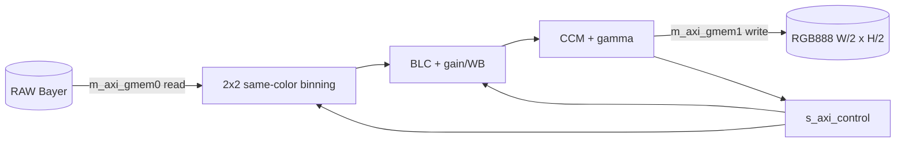

# lowlight_ISP Interface and Module Hierarchy

작성일: 2026-08-14
대상: `src/lowlight_isp.cpp`, `include/lowlight_isp.hpp`
배포 후보 top: `rm_lowlight_isp_top`
개발·분석 top: `lowlight_isp`

## Overview

`lowlight_ISP`는 저조도 RAW12 RGGB 입력을 same-color binning하고 보정하여
절반 너비·절반 높이의 RGB888 프레임을 만드는 전용 ISP arm이다.

```text
RAW12 RGGB W×H
  -> same-color 2×2 binning (BLC 이전)
  -> black-level correction
  -> exposure 2.0× + per-channel WB
  -> 3×3 Q8 color-correction matrix
  -> 12→8-bit quantization
  -> gamma 2.0 LUT
  -> packed RGB888 0x00RRGGBB, floor(W/2)×floor(H/2)
```

| Top | 목적 | 인자 수 | Binning | DFX 계약 |
|---|---|---:|---|---|
| `lowlight_isp` | 개발·ablation | 7 | `bin_mode`로 subsample/binning 선택 | 분석용 |
| `rm_lowlight_isp_top` | 배포 후보 RM | 6 | same-color binning 고정 | 다른 tone RM과 동일 서명 |



## 1. Source-level interface

### 1.1 `lowlight_isp`

```cpp
extern "C" void lowlight_isp(
    const uint16_t* raw_bayer,
    uint32_t* rgb_out,
    int width,
    int height,
    int bin_mode,
    int* out_width,
    int* out_height);
```

| 인자 | 방향 | 타입 | 의미 |
|---|---|---|---|
| `raw_bayer` | in | `const uint16_t*` | `W×H` RGGB RAW12 입력 |
| `rgb_out` | out | `uint32_t*` | `0x00RRGGBB`, 최대 `floor(W/2)×floor(H/2)` words |
| `width`, `height` | in | `int` | 입력 프레임 크기 |
| `bin_mode` | in | `int` | `0`: subsample ablation, `1`: same-color binning |
| `out_width` | out | `int*` | `max(1, width/2)` |
| `out_height` | out | `int*` | `max(1, height/2)` |

### 1.2 `rm_lowlight_isp_top`

```cpp
extern "C" void rm_lowlight_isp_top(
    const uint16_t* raw_bayer,
    uint32_t* rgb_out,
    int width,
    int height,
    int* out_width,
    int* out_height);
```

`LOWLIGHT_ISP_BIN_BINNING`을 고정 사용한다. 이 6개 인자의 타입·순서·개수는
`rm_default_isp_top`, `rm_normal_tone_top`, `rm_low_light_tone_top`과 동일하다.

### 1.3 HLS mapping

| C 객체 | pragma/bundle | RTL 역할 |
|---|---|---|
| `raw_bayer` | `m_axi gmem0`, `s_axilite control` | RAW burst read + 64-bit base-address register |
| `rgb_out` | `m_axi gmem1`, `s_axilite control` | RGB burst write + 64-bit base-address register |
| `width`, `height` | `s_axilite control` | 32-bit scalar input |
| `bin_mode` | `s_axilite control` | 개발 top 전용 scalar input |
| `out_width`, `out_height` | `s_axilite control` | output-size read-back |
| `return` | `s_axilite control` | `ap_start/done/idle/ready` |

## 2. Vitis RTL external interface

`rm_lowlight_isp_top`은 default RM과 같은 외부 bundle 계약을 사용한다.

| Bundle | 방향 | 핵심 폭 | 역할 |
|---|---|---|---|
| `s_axi_control` | slave | address 7-bit, data 32-bit | 제어·인자·output metadata |
| `m_axi_gmem0` | master | address 64-bit, RAW data 16-bit/adapter-dependent | 입력 read |
| `m_axi_gmem1` | master | address 64-bit, RGB data 32-bit | 출력 write |
| `ap_clk` | in | 1 | HLS clock |
| `ap_rst_n` | in | 1 | active-low top reset |
| `interrupt` | out | 1 | completion interrupt |

AXI 채널은 AW/W/B/AR/R의 표준 full-master 신호를 가진다. 주소·제어 신호는
`AW/ARADDR[63:0]`, `AW/ARLEN`, `SIZE`, `BURST`, `LOCK`, `CACHE`, `PROT`,
`QOS`, `REGION`, `ID`, `USER`이며 데이터 채널은 `VALID/READY/DATA/STRB/LAST`
및 response 신호로 구성된다.

> `reports/csynth/rm_lowlight_isp_top_csynth.rpt`의 Interface Summary는 top
> wrapper 전체가 아니라 자동 생성된
> `run_lowlight_isp_Pipeline_VITIS_LOOP_186_1_VITIS_LOOP_188_2` 내부 모듈
> 포트를 기록한다. 이 표에서 gmem0 16-bit, gmem1 32-bit와 내부 scalar를
> 실측할 수 있지만, top의 AXI-Lite 전체 포트 근거로 직접 사용하면 안 된다.
> top 계약은 소스 pragma와 동일 서명의 다른 RM top 합성 결과를 함께 확인한다.

## 3. Module hierarchy

### 3.1 Semantic hierarchy

```text
lowlight_isp / rm_lowlight_isp_top
└── run_lowlight_isp
    └── output pixel loops (by, bx)
        ├── binned_rgb
        │   ├── binned_raw
        │   │   └── cell_sites
        │   └── correct_channel
        ├── ccm_channel × 3
        ├── tone × 3
        └── pack_rgb
```

### 3.2 Stage-by-stage ports and data widths

| Stage/helper | 주요 입력 | 주요 출력 | 내부 의미 |
|---|---|---|---|
| `cell_sites` | RAW pointer, W/H, cell x/y | R/B 4 samples, G 8 samples | RGGB 4×4 source neighborhood 수집 |
| `binned_raw` | site samples, `bin_mode` | binned R/G/B | same-color average 또는 subsample |
| `correct_channel` | binned value, WB Q8 | corrected 12-bit | pedestal 제거, range restore, 2× exposure, WB |
| `binned_rgb` | RAW frame, output coordinate | R12/G12/B12 | binning과 correction 결합 |
| `ccm_channel` | R12/G12/B12, row | corrected channel | signed 3×3 Q8 matrix와 clamp |
| `tone` | corrected 12-bit | 8-bit | `>>4` LUT index와 gamma 2.0 ROM |
| `pack_rgb` | R8/G8/B8 | 32-bit word | `0x00RRGGBB` |

helper는 inline되어 Vitis RTL에서 독립적인 모듈 경계로 남지 않을 수 있다.
실측 csynth에는 output loop가 별도 pipelined module로 나타나며, 이 모듈이
gmem0/gmem1과 연결되어 binning·보정·pack 연산을 수행한다.

### 3.3 Internal pipelined-loop interface

| 그룹 | 포트 | 방향/폭 | 의미 |
|---|---|---|---|
| lifecycle | `ap_clk`, `ap_rst`, `ap_start` | in, 1 | 내부 pipeline 실행 |
| lifecycle | `ap_done`, `ap_idle`, `ap_ready` | out, 1 | pipeline 상태 |
| RAW memory | `m_axi_gmem0_*` | AXI master, data 16 | input samples |
| RGB memory | `m_axi_gmem1_*` | AXI master, data 32 | packed output |
| loop bound | `bound` | in, 60 | flattened output iteration bound |
| dimensions | `height`, `width` | in, 31 each | loop/address calculation |
| address helpers | `sext_ln186`, `smax`, `hi_assign*`, `sub*`, `width_cast` | in, 30–62 | synthesized loop/address terms |
| RAW base | `raw` | in, 64 | raw buffer base address |

`AWLEN/ARLEN`이 이 내부 module report에서 32-bit로 표시되는 것은 Vitis 내부
pipeline adapter 표현이다. 배포 top-level AXI port 폭을 결정할 때는 generated
top RTL 또는 IP component metadata를 최종 기준으로 삼아야 한다.

## 4. Output-shape and boundary behavior

- 정상 크기에서는 `out_width = width/2`, `out_height = height/2`의 정수 나눗셈이다.
- 한 축이 1인 작은 입력은 `bin_dim()`이 최소 1을 반환한다.
- odd input dimension의 남는 행·열은 output shape에서 버려지지만,
  `cell_sites`는 source coordinate를 clamp하여 경계 밖 read를 방지한다.
- output buffer는 최악의 경우 `W×H` 용량을 제공하도록 API가 정의되어 있지만
  실제 write 수는 binned output pixel 수다.

## 5. DFX contract and integration

RP 경계에서 다음 C-level signature를 유지한다.

```text
(raw_bayer, rgb_out, width, height, out_width, out_height)
```

동일한 bundle 이름(`gmem0`, `gmem1`, `control`), clock/reset polarity, AXI
폭과 partition-pin topology를 다른 RM과 맞춰야 한다. Lowlight arm만 출력 크기가
H/2×W/2이므로 downstream은 `out_width/out_height` read-back 값을 반드시 사용해야
한다.

## 6. Verification status

| 항목 | 상태 | 근거 |
|---|---|---|
| C header signature | 확인 | `include/lowlight_isp.hpp` |
| Golden/C-sim | PASS | `make lowlight-isp-csim` 계열 결과 |
| Vitis csynth | PASS | `reports/csynth/rm_lowlight_isp_top_csynth.rpt` |
| DFX 6-argument source contract | 확인 | header와 source pragma |
| Top generated RTL full port archive | 저장소에 없음 | 재합성 export 필요 |
| C/RTL formal equivalence | 미실시 | co-sim/formal 필요 |

## 7. References

- `include/lowlight_isp.hpp`
- `src/lowlight_isp.cpp`
- `src/lowlight_isp.md`
- `reports/csynth/rm_lowlight_isp_top_csynth.rpt`
- `results/default-lowlight-isp-summary-2026-08-06.md`
- `DEFAULT_INTERFACE.md`
