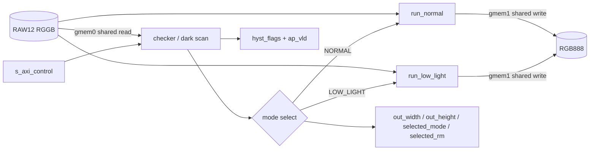

# DFXISP Top Interface and Module Hierarchy

작성일: 2026-08-14
HLS top: `dfxisp_accel`
대상: `src/dfxisp_accel.cpp`, `include/dfxisp_accel.hpp`

## Overview

`dfxisp_accel`은 scene checker와 NORMAL/LOW_LIGHT 처리 경로를 한 HLS top에
통합한 Arm2 register-only 구조다. 프레임마다 mode를 결정하고 두 tone arm 중
정확히 하나만 실행한 뒤 출력 크기와 선택 결과를 software/fabric에 전달한다.



핵심 특성은 다음과 같다.

- `gmem0` RAW read bundle을 checker, normal arm, low-light arm이 공유한다.
- `gmem1` RGB write bundle을 두 처리 arm이 공유한다.
- normal/low-light arm은 상호배타적으로 하나만 start되므로 write 충돌이 없다.
- NORMAL 출력은 `W×H`, LOW_LIGHT 출력은 `floor(W/2)×floor(H/2)`다.
- `selected_mode`와 `selected_rm`은 AXI4-Lite read-back이고, `hyst_flags`는
  static fabric으로 직접 나가는 `ap_vld` wire pair다.
- 이 unified top에는 실제 Vivado DFX RP 경계가 없다. 별도 RM top들이 DFX
  구현용이며, 여기서는 기능과 선택 정책을 한 IP에서 검증한다.

## 1. Source-level interface

```cpp
extern "C" void dfxisp_accel(
    const uint16_t* raw_bayer,
    uint32_t* rgb_out,
    int width,
    int height,
    int mode,
    uint16_t dark_pixel_threshold,
    int* out_width,
    int* out_height,
    int* selected_mode,
    int* selected_rm,
    int* hyst_flags);
```

| 인자 | 방향 | 타입 | 의미 |
|---|---|---|---|
| `raw_bayer` | in | `const uint16_t*` | RAW12 RGGB input, `W×H` words |
| `rgb_out` | out | `uint32_t*` | packed RGB888 `0x00RRGGBB` |
| `width`, `height` | in | `int` | input frame dimensions |
| `mode` | in | `int` | `0` NORMAL, `1` LOW_LIGHT, `2` AUTO |
| `dark_pixel_threshold` | in | `uint16_t` | AUTO dark-pixel RAW threshold |
| `out_width`, `out_height` | out | `int*` | selected arm output dimensions |
| `selected_mode` | out | `int*` | resolved NORMAL/LOW_LIGHT mode |
| `selected_rm` | out | `int*` | selected tone RM identifier |
| `hyst_flags` | out | `int*` | bit0 above 64%, bit1 below 60% |

metadata pointer는 null일 수 있으며 해당 field write만 생략된다. invalid frame
argument에서는 output shape를 0으로 설정하고 정상 기본 metadata를 기록한 뒤
처리를 종료한다.

## 2. Mode and output contract

| 입력 `mode` | Checker 동작 | `selected_mode` | `selected_rm` | 출력 크기 |
|---:|---|---:|---:|---|
| `0` NORMAL | scan bypass, below-exit flag | 0 | 0 NORMAL_TONE | `W×H` |
| `1` LOW_LIGHT | scan bypass, above-enter flag | 1 | 1 LOW_LIGHT_TONE | `W/2×H/2` |
| `2` AUTO | dark-pixel ratio 측정 | 62% single-frame verdict | verdict와 동일 | 선택 arm 기준 |

AUTO verdict는 `dark_count*100 > 62*(width*height)` 정수 비교다. Schmitt
flag는 독립적으로 `>64%`와 `<60%`를 나타내며, stable frame-to-frame mode는
`checker_hysteresis`가 담당한다.

## 3. HLS pragma mapping

| 객체 | HLS interface | Bundle/역할 |
|---|---|---|
| `raw_bayer` | `m_axi offset=slave depth=64` + `s_axilite` | `gmem0` burst read, control pointer |
| `rgb_out` | `m_axi offset=slave depth=64` + `s_axilite` | `gmem1` burst write, control pointer |
| `width`, `height`, `mode` | `s_axilite` | control scalar registers |
| `dark_pixel_threshold` | `s_axilite` | RAW threshold register |
| `out_width`, `out_height` | `s_axilite` | output shape read-back |
| `selected_mode`, `selected_rm` | `s_axilite` | selection read-back |
| `hyst_flags` | `ap_vld` | 32-bit value + one-cycle valid pulse |
| `return` | `s_axilite` | start/done/idle/ready and interrupt control |

`depth=64`는 현재 RTL co-simulation BFM fixture 크기이며 synthesized AXI master의
실제 runtime frame 크기를 64 pixels로 제한하지 않는다.

## 4. Vitis HLS top-level RTL ports

근거: `reports/csynth/dfxisp_accel_ver1_csynth.rpt`의 Vitis HLS 2024.1
Interface Summary.

### 4.1 Clock and control

| 포트 | 방향 | 폭 | 의미 |
|---|---|---:|---|
| `ap_clk` | in | 1 | HLS IP clock |
| `ap_rst_n` | in | 1 | active-low reset |
| `interrupt` | out | 1 | AXI control interrupt |

### 4.2 AXI4-Lite `s_axi_control`

| Channel | Input ports | Output ports |
|---|---|---|
| AW | `AWVALID`, `AWADDR[6:0]` | `AWREADY` |
| W | `WVALID`, `WDATA[31:0]`, `WSTRB[3:0]` | `WREADY` |
| B | `BREADY` | `BVALID`, `BRESP[1:0]` |
| AR | `ARVALID`, `ARADDR[6:0]` | `ARREADY` |
| R | `RREADY` | `RVALID`, `RDATA[31:0]`, `RRESP[1:0]` |

주소 폭 7-bit이므로 control address space는 128 bytes다. 생성된 driver/header가
현재 저장소에 없으므로 각 인자의 정확한 byte offset은 확정하지 않는다.

### 4.3 AXI4 master bundles

| Bundle | 주 사용 | Address | Data | Burst length | Strobe |
|---|---|---:|---:|---:|---:|
| `m_axi_gmem0` | RAW read | 64 | 32 | 8 | 4 |
| `m_axi_gmem1` | RGB write | 64 | 32 | 8 | 4 |

두 bundle 모두 AW/W/B/AR/R full AXI signal set과 `VALID/READY`, `ID`, `USER`,
`SIZE`, `BURST`, `LOCK`, `CACHE`, `PROT`, `QOS`, `REGION`, `RESP`, `LAST`를
포함한다. HLS template 때문에 의미상 사용하지 않는 방향의 channel도 top port에
나타난다.

### 4.4 `hyst_flags` version caveat

현재 source에는 다음 fabric ports가 요구된다.

| 포트 | 방향 | 폭 | 프로토콜 |
|---|---|---:|---|
| `hyst_flags` | out | 32 | `ap_vld` data |
| `hyst_flags_ap_vld` | out | 1 | valid pulse |

하지만 `dfxisp_accel_ver1_csynth.rpt`는 이 port가 추가되기 전 합성본이라 Interface
Summary에 두 신호가 없다. `checker_scan`의 별도 csynth에서는 동일한 `ap_vld`
형태가 확인됐지만, unified `dfxisp_accel` top은 재합성하여 실제 포트를 갱신해야
한다.

## 5. Direct module hierarchy

2026-07-03 generated RTL의 top-level direct instances는 다음 여섯 개다.

| 인스턴스 | RTL module 역할 | 포트 수 | 상수 tie-off |
|---|---|---:|---:|
| `PIPE151` | checker/dark scan pipeline | 57 | 10 |
| `run_normal` | full-resolution NORMAL path | 102 | 21 |
| `run_low_light` | half-resolution LOW_LIGHT path | 104 | 21 |
| `control_s_axi` | AXI4-Lite register file | 39 | 1 |
| `gmem0_m_axi` | shared RAW AXI master adapter | 66 | 8 |
| `gmem1_m_axi` | shared RGB AXI master adapter | 66 | 5 |
| 합계 | direct child ports | 434 | 66 |

```text
dfxisp_accel
├── control_s_axi
├── PIPE151 (checker/dark scan)
├── run_normal
│   ├── RGGB bilinear demosaic
│   ├── baseline_isp_core
│   └── RM_NORMAL_TONE: gain 1.25× + gamma 2.0
├── run_low_light
│   ├── 2×2 binning-demosaic
│   ├── baseline_isp_core
│   └── RM_LOW_LIGHT_TONE: gain 2.0× + gamma 2.0
├── gmem0_m_axi
└── gmem1_m_axi
```

## 6. Module-by-module interfaces

### 6.1 `control_s_axi`

PS가 쓰는 `raw_bayer`, `rgb_out`, `width`, `height`, `mode`,
`dark_pixel_threshold`를 register로 보관한다. 계산 결과인 `out_width`,
`out_height`, `selected_mode`, `selected_rm`과 valid 상태를 read-back으로
노출한다. 값은 top의 `*_read_reg_*` register에 한 번 더 latch되어 child
pipeline에 전달된다.

### 6.2 `PIPE151`

| 포트군 | 대표 포트 | 역할 |
|---|---|---|
| lifecycle | `ap_clk`, `ap_rst`, `ap_start/done/idle/ready` | scan scheduling |
| RAW AXI | `m_axi_gmem0_*` | input read |
| scalar | `n`, `sext_ln151`, `dark_pixel_threshold` | pixel count/address/threshold |
| result | `dark_out`, `dark_out_ap_vld` | dark pixel count |

`dark_out`은 top에서 ×100 정수 스케일로 변환되어 mode와 Schmitt edge 비교에
사용된다.

### 6.3 `run_normal`

`gmem0` read와 `gmem1` write, `raw`/`rgb_out` 64-bit base address,
`width`/`height` scalar를 받는다. full-resolution demosaic 후 shared baseline
correction과 normal gain/gamma를 적용한다. 완료 결과는 `W×H`다.

### 6.4 `run_low_light`

normal과 같은 memory/address/control 포트군을 사용하지만 2×2 RAW
binning-demosaic를 수행한다. shared baseline correction 뒤 2.0× gain과 gamma를
적용하며 output shape는 `floor(W/2)×floor(H/2)`다.

### 6.5 `gmem0_m_axi`

checker, normal, low-light 세 producer의 AR request를 하나의 external AXI read
channel로 중재한다. external `ARREADY/RVALID/RDATA/RFIFONUM` response는 세 child에
fan-out된다. child의 write-side response는 사용하지 않아 일부 입력이 constant로
tie-off된다.

### 6.6 `gmem1_m_axi`

normal과 low-light 두 producer의 AW/W request를 하나의 external write channel로
중재한다. 두 arm의 start가 상호배타라 정상 동작에서는 동시에 write하지 않는다.
read-side input은 사용하지 않아 constant tie-off된다.

## 7. Scheduling and handshake

1. PS가 control register에 buffer address, dimensions, mode, threshold를 쓴다.
2. `ap_start` 후 AUTO이면 checker scan을 실행하고 dark count를 계산한다.
3. forced mode는 scan을 우회하고 해당 mode와 일치하는 Schmitt flag를 만든다.
4. selection logic가 `run_normal` 또는 `run_low_light` 하나만 start한다.
5. 선택된 arm이 gmem0에서 읽고 gmem1에 출력한다.
6. 완료 후 output shape와 selected metadata를 read-back register에 기록한다.
7. `ap_done`/interrupt를 갱신하고 `hyst_flags_ap_vld`를 한 번 pulse한다.

## 8. Relationship to DFX deployment

`dfxisp_accel`은 두 경로를 동시에 포함한 비교·검증용 unified IP다. 실제 DFX
구성에서는 shared/static region과 다음 동일 서명의 RM 후보를 분리한다.

- `rm_normal_tone_top`
- `rm_low_light_tone_top`
- `rm_default_isp_top`
- `rm_lowlight_isp_top`

각 RM은 `(raw_bayer, rgb_out, width, height, out_width, out_height)` 계약을
공유해야 한다. 실제 RP 호환성에는 C signature 외에도 AXI bundle, clock/reset,
partition pin 방향·폭, Vivado DFX implementation 결과의 일치가 필요하다.

## 9. Verification and limitations

| 항목 | 상태 | 근거 |
|---|---|---|
| Golden vectors | PASS | 13 cases, 1,913 data rows |
| C-sim | PASS | 726 output pixels, smoke tests |
| Architecture gates | PASS | shared core, mutual exclusion, output shape |
| Vitis csynth | PASS | `dfxisp_accel_ver1_csynth.rpt` |
| 6 direct instances/434 connections | 확인 | generated Verilog mechanical extraction |
| Current `hyst_flags` unified-top RTL | 재합성 필요 | report가 source 변경보다 오래됨 |
| Exact AXI-Lite byte offsets | 미확인 | generated control RTL/header 미보관 |
| Unified top의 실제 DFX RP boundary | 없음 | register-only Arm2 구조 |
| C/RTL formal equivalence | 미실시 | cosim/formal 별도 필요 |

## 10. References

- `include/dfxisp_accel.hpp`
- `src/dfxisp_accel.cpp`
- `reports/csynth/dfxisp_accel_ver1_csynth.rpt`
- `results/dfxisp-accel-connectivity-2026-07-03.md`
- `results/HW-INTERFACE-PIN-MODULE-PROTOCOL-2026-08-03.md`
- `DEFAULT_INTERFACE.md`
- `LOWLIGHT_INTERFACE.md`
- `CHECKER_INTERFACE.md`
