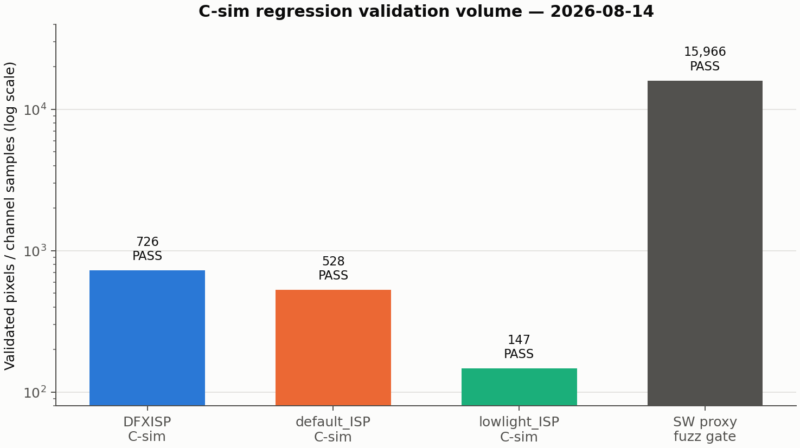
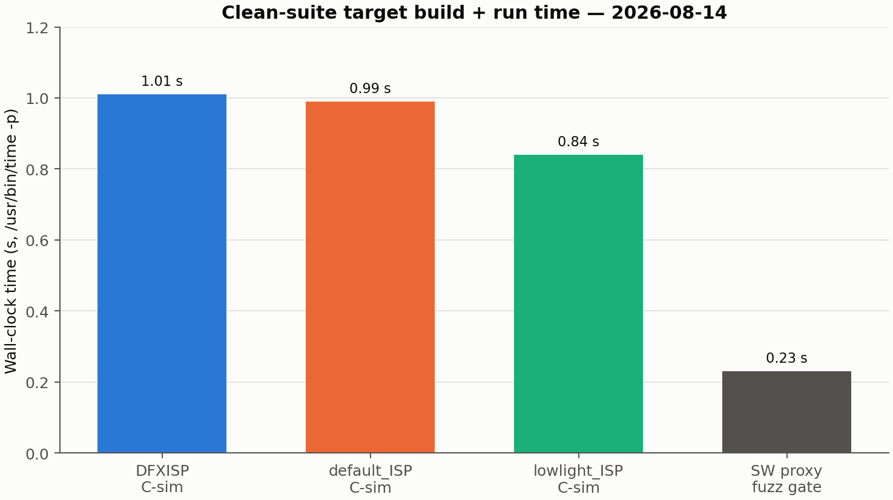
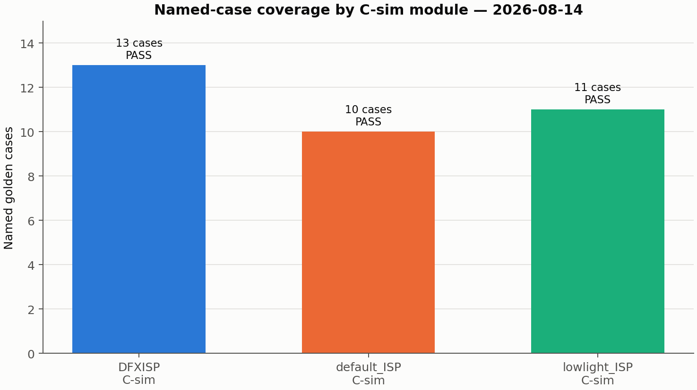

<!--
=============================================================================
File   : isppipeline/hls/results/csim-rerun-2026-08-14.md
Date   : 2026-08-14 KST
Function: clean build에서 DFXISP/default_ISP/lowlight_ISP C-sim과 신규 arm SW proxy
          교차검증 게이트를 재실행하고 bit-exact 회귀 상태를 기록한다.
Sources: Makefile, tests/{golden_vectors,default_isp_golden_vectors,
         lowlight_isp_golden_vectors}.csv, tests/test_*_csim.cpp,
         ../sw/{gen_default_isp_golden.py,gen_lowlight_isp_golden.py,
         verify_new_arm_pipelines.py}, commit 0ed0f44, commit c7e182e
=============================================================================
-->
# C-sim 회귀 스위트 clean 재실행 (2026-08-14)

## 0. 결론부터

- `make clean` 뒤 순서대로 실행한 네 게이트가 모두 종료 코드 0으로 **PASS**했다.
- C++ C-sim은 DFXISP 13케이스/726픽셀, default_ISP 10케이스/528픽셀,
  lowlight_ISP 11케이스/147픽셀을 독립 Python scalar golden과 픽셀 단위로 비교했다.
- 별도 SW proxy fuzz 게이트도 40 trials, 15,966 channel samples에서 vectorised proxy와
  scalar canonical golden이 bit-exact였다.
- 실측 wall-clock(`/usr/bin/time -p`의 `real`)은 각각 1.01 s, 0.99 s, 0.84 s,
  0.23 s였다.
- `default-isp-verify`와 `lowlight-isp-verify`가 다시 생성한 CSV는 실행 후 `git diff`가
  비어 있어 커밋된 파일과 바이트 단위로 동일했다.

> **범위 경계:** 여기서 C-sim은 HLS C++를 일반 `g++`로 컴파일해 순수 SW로 실행하고
> Python scalar reference의 golden vector와 출력 픽셀을 비교하는 시험이다. 따라서
> “C++ 논리가 맞는가”만 답하며 cycle 수, BRAM/DSP/FF/LUT 자원, 타이밍을 측정하거나
> 보증하지 않는다. `vitis_hls`/XSIM을 쓰는 csynth/co-sim은 별도 HW 검증 단계이며 이번
> 실행 범위 밖이다. 특히 README의 “C-synthesis / Co-sim 실행 노트”에 기록된 WSL2 +
> Vitis HLS 2024.1 + XSIM cosim post-check SIGSEGV 경로는 실행하지 않았다.

## 1. 실행 조건과 결과

작업 위치는 `isppipeline/hls/`이며, 먼저 `make clean`으로 `build/`를 제거했다. 이후
아래 네 명령을 표의 순서로 각각 실행했다. 시간은 추정값이 아니라 각 명령을
`/usr/bin/time -p`로 감싼 이번 실행의 `real` 출력이다.

| 순서 | 명령 | 종료 코드 | 실측 wall-clock | 검증량 | 결과 |
|---:|---|---:|---:|---:|---|
| 1 | `make csim` | 0 | 1.01 s | 726 pixels | PASS |
| 2 | `make default-isp-verify` | 0 | 0.99 s | 528 pixels | PASS |
| 3 | `make lowlight-isp-verify` | 0 | 0.84 s | 147 pixels | PASS |
| 4 | `make verify-new-arms` | 0 | 0.23 s | 40 trials / 15,966 channel samples | PASS |

컴파일은 세 C-sim 모두 `g++ -std=c++17 -O2 -Wall -Wextra -Werror
-Wno-unknown-pragmas`로 수행됐다. 전체 출력의 핵심 종료 문구는 다음과 같았다.

```text
DFXISP golden vector compare passed (726 pixels)
default_ISP golden vector compare passed (528 pixels)
lowlight_ISP golden vector compare passed (147 pixels)
[verify_new_arm_pipelines] PASS: 40 trials, 15966 channel samples, ...
```





## 2. 모듈별 케이스 결과

픽셀 수는 각 golden CSV의 케이스별 `out_w × out_h`이며, 합계가 C++ testbench가
출력한 checked pixel 수와 일치하는지 교차 확인했다. 모든 케이스가 동일 실행의 전체
compare PASS에 포함된다.

### 2.1 DFXISP (`dfxisp_accel`)

`src/dfxisp_accel.cpp`와 `tests/test_dfxisp_csim.cpp`를 빌드해 이미 커밋된
`tests/golden_vectors.csv`를 그대로 사용했다. 범위 밖인 top-level `golden` 타깃은
호출하지 않았다.

| 케이스 | 출력 픽셀 | 결과 |
|---|---:|---|
| `auto_boundary_ratio_61_8x8` | 64 | PASS |
| `auto_boundary_ratio_62p5_8x8` | 16 | PASS |
| `auto_dark_trigger_8x8` | 16 | PASS |
| `auto_raw12_thr256_at_threshold_8x8` | 64 | PASS |
| `auto_raw12_thr256_below_threshold_8x8` | 16 | PASS |
| `odd_dimension_lowlight_7x5` | 6 | PASS |
| `seq1_bright_normal_grid_8x8` | 64 | PASS |
| `seq2_bright_normal_grid_8x8` | 64 | PASS |
| `seq3_mixed_normal_grid_16x16` | 256 | PASS |
| `seq4_dark_lowlight_grid_8x8` | 16 | PASS |
| `seq5_dark_lowlight_grid_8x8` | 16 | PASS |
| `seq6_mixed_dark_lowlight_grid_16x16` | 64 | PASS |
| `seq7_bright_recovery_auto_8x8` | 64 | PASS |
| **합계** | **726** | **PASS** |

추가로 같은 실행에서 `DFXISP hysteresis-flag export tests passed`와
`DFXISP C-sim smoke tests passed`도 확인됐다.

### 2.2 default_ISP

`../sw/gen_default_isp_golden.py`로 scalar golden을 재생성한 뒤
`src/default_isp.cpp`의 출력을 비교했다.

| 케이스 | 출력 픽셀 | 결과 |
|---|---:|---|
| `blue_cast_awb_off` | 64 | PASS |
| `blue_cast_awb_on` | 64 | PASS |
| `flat_dark_awb_on` | 64 | PASS |
| `flat_mid_awb_off` | 64 | PASS |
| `flat_mid_awb_on` | 64 | PASS |
| `gradient_awb_off` | 64 | PASS |
| `gradient_awb_on` | 64 | PASS |
| `odd_dims_awb_on` | 15 | PASS |
| `one_pixel_awb_on` | 1 | PASS |
| `saturated_awb_on` | 64 | PASS |
| **합계** | **528** | **PASS** |

### 2.3 lowlight_ISP

`../sw/gen_lowlight_isp_golden.py`로 scalar golden을 재생성한 뒤
`src/lowlight_isp.cpp`의 출력을 비교했다.

| 케이스 | 출력 픽셀 | 결과 |
|---|---:|---|
| `flat_dark` | 16 | PASS |
| `flat_mid` | 16 | PASS |
| `flat_near_floor` | 16 | PASS |
| `gradient` | 16 | PASS |
| `gradient_subsample` | 16 | PASS |
| `hard_edge` | 16 | PASS |
| `noisy_dark` | 16 | PASS |
| `noisy_dark_subsample` | 16 | PASS |
| `odd_dims` | 2 | PASS |
| `one_pixel` | 1 | PASS |
| `saturated` | 16 | PASS |
| **합계** | **147** | **PASS** |



## 3. SW vectorised proxy 교차검증

`make verify-new-arms`는 C++ 바이너리를 시험하는 앞의 세 항목과 성격이 다르다.
`../sw/verify_new_arm_pipelines.py`가 dataset 크기 프레임 렌더링에 쓰이는 NumPy
vectorised proxy인 `default_isp_pipeline.py`와 `lowlight_isp_pipeline.py`를 동일한
scalar canonical golden에 대해 fuzz한다. 이번 결과는 **40 random trials / 15,966
channel samples, PASS**였다.

이 게이트는 C++와 golden이 같은 실수를 함께 복제해도 C-sim 양쪽 비교만으로는 잡지
못하는 종류의 오류를 겨냥한다. 스크립트 docstring이 기록한 2026-07-02
chroma-collapse 사례가 유지 이유다. 그러므로 15,966은 C-sim 픽셀 수와 같은 단위가
아닌 channel sample 수이며, 그림에서도 이를 구분해 표기했다.

### 3.1 "C++ = SW proxy"는 직접 비교가 아니라 golden을 매개로 한 전이 결론

§2와 §3은 같은 대상을 서로 다른 두 축으로 비교한다 — 입력도 다르고 비교
당사자도 다르다:

```
① C-sim(§2)   HLS C++(src/*.cpp)          ↔ scalar golden(gen_*_golden.py,
                                              DFXISP는 이미 커밋된 golden_vectors.csv)
               — 손으로 짠 고정 케이스 26개(§2.1-2.3 표), bit-exact

② fuzz(§3)    vectorised proxy(*_pipeline.py) ↔ scalar golden(①과 동일 파일)
               — 랜덤 시드 40 trials, 15,966 channel samples, bit-exact
```

`verify_new_arm_pipelines.py`는 `default_isp_pipeline`/`lowlight_isp_pipeline`을
`gen_default_isp_golden`/`gen_lowlight_isp_golden`하고만 비교한다 — HLS C++는 이
게이트에 전혀 등장하지 않는다(import 목록 확인: `DP`/`LP`가 `DG`/`LG`와만 대조됨).
즉 이번 실행은 **같은 입력에 대해 C++ 출력과 proxy 출력을 나란히 diff한 적이
없다.** ①과 ②가 같은 golden 참조점을 공유하므로 "HLS C++ = 스칼라 golden"과
"vectorised proxy = 스칼라 golden"을 잇는 전이(transitive) 추론으로 "HLS C++ =
vectorised proxy"라고 말할 수는 있지만, 이는 두 개의 독립된 bit-exact 결과를
합친 결론이지 단일 직접 비교의 결과가 아니다 — 재현하거나 인용할 때 이 구분을
유지할 것.

## 4. Makefile 회귀와 이번 재확인

커밋 `0ed0f44`는 중복이던
`isppipeline/hls/tools/{gen_default_isp_golden,gen_lowlight_isp_golden}.py`를 삭제하고
`verify_new_arm_pipelines.py`를 `isppipeline/sw/`로 옮겼지만, Makefile의
`default-isp-golden`, `lowlight-isp-golden`, `verify-new-arms` 세 타깃은 삭제된 옛
`hls/tools/` 경로를 계속 가리켰다. 결과적으로 파일 없음/모듈 import 실패로 세 타깃이
깨진 상태였다.

커밋 `c7e182e`는 세 참조를 canonical `../sw/` 경로로 고쳤다. 이번 clean 재실행에서
Makefile을 우회하지 않고 바로 그 세 타깃을 호출해 모두 PASS했으므로 경로 수정이 현재
HEAD에서도 유효함을 재확인했다. 두 재생성 golden CSV는 커밋본과 차이가 없었다.

## 5. 의도적으로 하지 않은 일과 관찰 사항

- csynth, co-sim, `vitis_hls`, XSIM은 전혀 실행하지 않았다.
- `rm-golden`/`rm-csim`/`rm-verify`, top-level `golden`, `cross-check`, `py-verify`는
  2026-08-07에 은퇴한 v1 RM 경로를 참조하는 알려진 선행 상태이므로 호출하거나
  수정하지 않았다.
- DFXISP top-level `golden`도 archived `tools/gen_golden_vectors.py`를 참조하므로
  호출하거나 고치지 않았다. `make csim`은 커밋된 golden을 정상 사용했다.
- 예상 밖 실패나 케이스/검증량 불일치는 없었다. 측정 중 matplotlib 사용자 설정
  디렉터리가 쓰기 불가여서 자동으로 `/tmp` cache를 사용했다는 경고만 있었으며,
  PNG 생성 결과에는 영향이 없었다.
- `dataset/`에는 접근·생성·수정을 하지 않았고 최상위 구성은 실행 전후
  `LOD_test/`, `PASCAL_test/` 두 디렉터리뿐이다.

