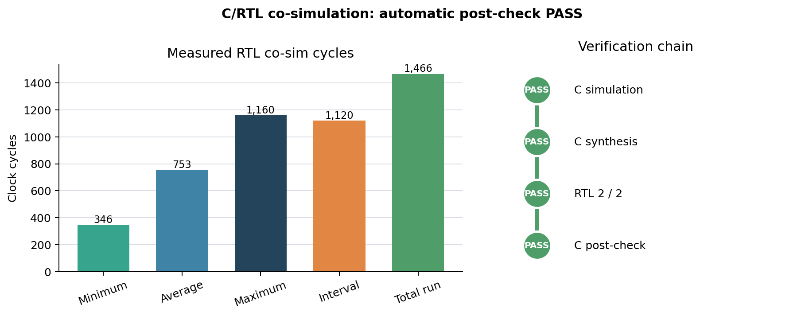
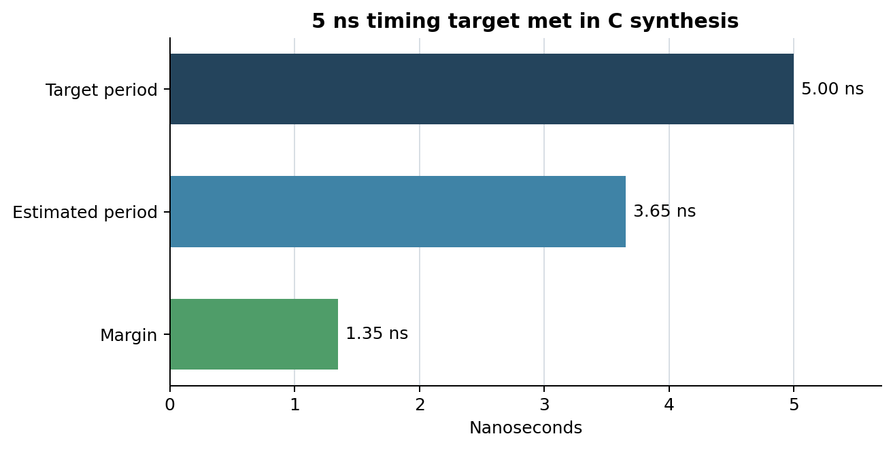
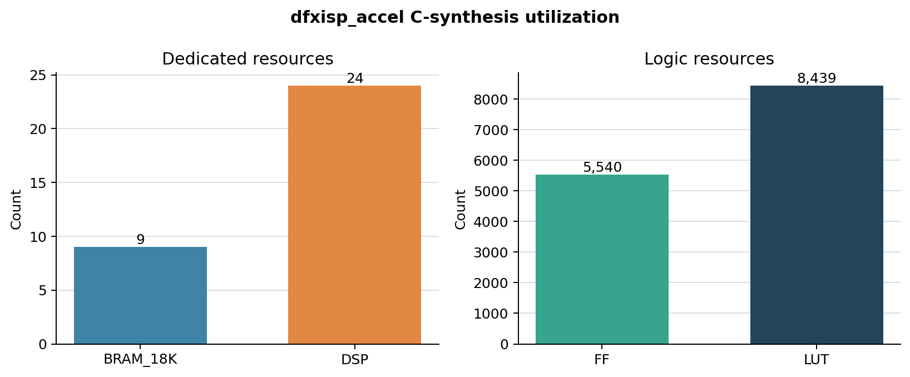

<!--
=============================================================================
File   : isppipeline/hls/results/csynth-cosim-rerun-2026-08-14.md
Date   : 2026-08-14 KST
Function: SIGSEGV 수정 후 dfxisp_accel csim/csynth/C-RTL co-sim clean 재실행의
          합성 자원·타이밍·RTL latency·자동 post-check 결과를 도표와 함께 기록한다.
Sources: /tmp/dfxisp-cosim-rerun.EqeHui/proj/solution1/{syn,sim}/report,
         src/dfxisp_accel.cpp, tests/test_dfxisp_cosim.cpp
=============================================================================
-->
# SIGSEGV 수정 후 csynth/co-sim 재실행 결과 (2026-08-14)

## 0. 요약

`dfxisp_accel`을 깨끗한 flat Vitis 프로젝트에서 `csim_design → csynth_design →
cosim_design` 순서로 다시 실행했다. **C simulation, C synthesis, RTL 2/2 transaction,
자동 C TB post-check가 모두 PASS**했고 SIGSEGV는 발생하지 않았다.

| 관문 | 결과 | 근거 |
|---|---|---|
| C simulation | PASS | `SIM 211-1 CSim done with 0 errors` |
| C synthesis | PASS | csynth report 생성, 5 ns target 충족 |
| Verilog RTL simulation | PASS | 2/2 transaction, `$finish` 정상 호출 |
| C TB post-check | PASS | `COSIM 212-1000` |
| 최종 co-sim status | **Pass** | `dfxisp_accel_cosim.rpt` |



## 1. 실행 환경과 방법

| 항목 | 값 |
|---|---|
| 실행 시각 | 2026-08-14 14:55 KST |
| OS | Ubuntu 22.04.5 LTS on WSL2 |
| Vitis HLS / XSIM | 2024.1 |
| FPGA part | `xczu7ev-ffvc1156-2-e` |
| target clock | 5.000 ns |
| RTL language | Verilog |
| testbench | `tests/test_dfxisp_cosim.cpp` |
| transaction | normal 8×8 + low-light 8×8, 총 2회 |

표준 중첩 프로젝트의 알려진 source-path 누락과 이번 co-sim 결과를 분리하기 위해
`dfxisp_accel.cpp`, 두 헤더, 전용 TB를 새 `/tmp/dfxisp-cosim-rerun.*` flat directory에
복사했다. 그 위치에서 다음 명령을 실행했다.

```tcl
csim_design
csynth_design
cosim_design -rtl verilog -tool xsim -trace_level none
```

`close_project` 뒤 Vitis prompt가 종료되지 않는 기존 hang 때문에 전체 프로세스는 timeout
wrapper로 관리했다. 이는 모든 report와 PASS marker가 생성된 뒤의 종료 문제이며 합성/
co-sim 판정에는 영향을 주지 않는다.

## 2. C synthesis 결과

### 2.1 타이밍

| target | estimated | margin |
|---:|---:|---:|
| 5.000 ns | 3.650 ns | **1.350 ns** |



3.650 ns 추정 경로는 5.000 ns target보다 1.350 ns 짧아 합성 단계 타이밍 목표를
충족한다. 역수 환산 추정치는 약 273.97 MHz다. 이는 post-route 주파수가 아니라 HLS
synthesis estimate임을 구분한다.

### 2.2 자원

| BRAM_18K | DSP | FF | LUT | URAM |
|---:|---:|---:|---:|---:|
| 9 | 24 | 5,540 | 8,439 | 0 |



이 값은 SIGSEGV 수정 보고서에 기록된 직전 측정과 동일하다. `m_axi depth`는 co-sim
verification adapter 힌트이므로 합성된 AXI master의 데이터패스 자원을 바꾸지 않았다.

합성 top의 동적 프레임 envelope 때문에 csynth latency 범위는 1~20,736,045 cycles로
보고된다. 이는 이번 8×8 co-sim의 실제 latency가 아니라 width/height 상한을 포함한 정적
분석 범위다.

## 3. C/RTL co-simulation 결과

### 3.1 자동 비교

```text
RTL Simulation : 0 / 2 [0.00%]
RTL Simulation : 1 / 2 [0.00%]
RTL Simulation : 2 / 2 [100.00%]
$finish called at time : 7482500 ps
INFO: [COSIM 212-316] Starting C post checking ...
DFXISP C/RTL co-simulation checks passed
INFO: [COSIM 212-1000] *** C/RTL co-simulation finished: PASS ***
```

과거에는 동일한 `Starting C post checking` 직후 `SIGSEGV`와 `COSIM 212-379`가
발생했다. 이번에는 같은 단계를 통과해 자동 C-vs-RTL 비교가 정상 종료했다. 따라서
“RTL만 실행됐고 bit-exact 자동 비교는 미완주”였던 과거 상태가 해소됐다.

### 3.2 RTL cycle 실측

| 지표 | min | avg | max |
|---|---:|---:|---:|
| latency | 346 | 753 | 1,160 |
| interval | 1,120 | 1,120 | 1,120 |

전체 2 transaction 실행 시간은 **1,466 cycles**다. 5 ns clock 기준 report상의 총 cycle을
단순 환산하면 7.330 µs이며, XSIM `$finish` 시각은 wrapper 초기화/종료를 포함해
7.4825 µs였다.

두 transaction의 latency 차이는 normal과 low-light datapath 및 출력 shape 차이에서
온다. 이 소형 TB는 latency benchmark가 아니라 양 datapath와 wrapper post-check의
회귀 gate다.

### 3.3 원본 waveform 산출물

같은 날 수정본을 `cosim_design -trace_level all`로 다시 실행했다. 이 실행도 RTL 2/2와
자동 C post-check가 PASS했다. 생성된 elaborated snapshot을 XSIM으로 직접 재호출해 전체
DUT 계층과 핵심 인터페이스 신호를 각각 VCD로 덤프했다.

| 파일 | 크기 | 내용 |
|---|---:|---|
| `simulation/dfxisp_accel_2026-08-14.wdb` | 약 1.1 MiB | Vivado/XSIM 네이티브 전체 waveform database |
| `simulation/dfxisp_accel_2026-08-14.wcfg` | 약 131 KiB | `trace_level all`이 만든 Vivado waveform 화면 구성 |
| `simulation/dfxisp_accel_full_2026-08-14.vcd` | 약 1.5 MiB | testbench top과 DUT 직하위 전체 신호 |
| `simulation/dfxisp_accel_essential_2026-08-14.vcd` | 약 62 KiB | `ap_*`, gmem0 AXI read, gmem1 AXI write handshake 중심 20개 신호 |
| `simulation/dump_{all,essential}_vcd.tcl` | — | elaborated XSIM snapshot에서 VCD를 재생성하는 Tcl |

무결성 확인 SHA-256:

```text
8287f4cfa7dd8afb9b801211a138c5324bae3938e66abe94eb4878ea97f3560f  dfxisp_accel_2026-08-14.wdb
6d97594d9505db1ea7d3081c1b3c020320f18ecd4d43246dcb111a4b6fe686ef  dfxisp_accel_essential_2026-08-14.vcd
107b158001b01724726f5dc6441062fe6be011a741de825b3a5e86912b3141e6  dfxisp_accel_full_2026-08-14.vcd
```

WDB는 Vivado에서 `open_wave_database`로 열고 WCFG를 적용할 수 있다. VCD는 GTKWave 등
표준 viewer에서 직접 열 수 있다. essential VCD는 원본 전체 실행 시간 7.4825 µs와 두
transaction을 유지하면서 탐색할 신호 수만 줄인 파일이다.

## 4. 판정

이번 재실행으로 다음을 확인했다.

1. `depth=64`와 유효한 top-level 출력 포인터를 사용하는 전용 TB는 Vitis HLS 2024.1
   verification adapter 계약에 맞는다.
2. 합성된 Verilog가 normal/low-light 두 transaction을 정상 완료한다.
3. Vitis 자동 C post-check가 PASS하므로 과거 SIGSEGV는 재현되지 않는다.
4. 합성 자원과 3.650 ns timing estimate는 직전 측정과 동일하다.
5. 남은 source-path 누락과 `close_project` 종료 hang은 co-sim 기능 정합성과 독립된
   tool invocation 문제다.

원인·수정 상세는 `cosim-postcheck-sigsegv-fix-2026-08-14.md`를 참조한다.

## 5. Figure 재생성

도표는 report 숫자를 하드코딩한 스냅샷 생성기이며 외부 데이터나 추정값을 사용하지 않는다.

```bash
python3 results/tools/plot_csynth_cosim_rerun.py
```

생성 파일:

- `results/csynth-resources-2026-08-14.png`
- `results/csynth-timing-2026-08-14.png`
- `results/cosim-pass-summary-2026-08-14.png`

Waveform은 `results/simulation/`에 별도로 보존한다. VCD 재덤프는 합성 프로젝트의
`solution1/sim/verilog`에서 다음처럼 실행한다.

```bash
xsim --noieeewarnings dfxisp_accel -tclbatch dump_all_vcd.tcl
xsim --noieeewarnings dfxisp_accel -tclbatch dump_essential_vcd.tcl
```
