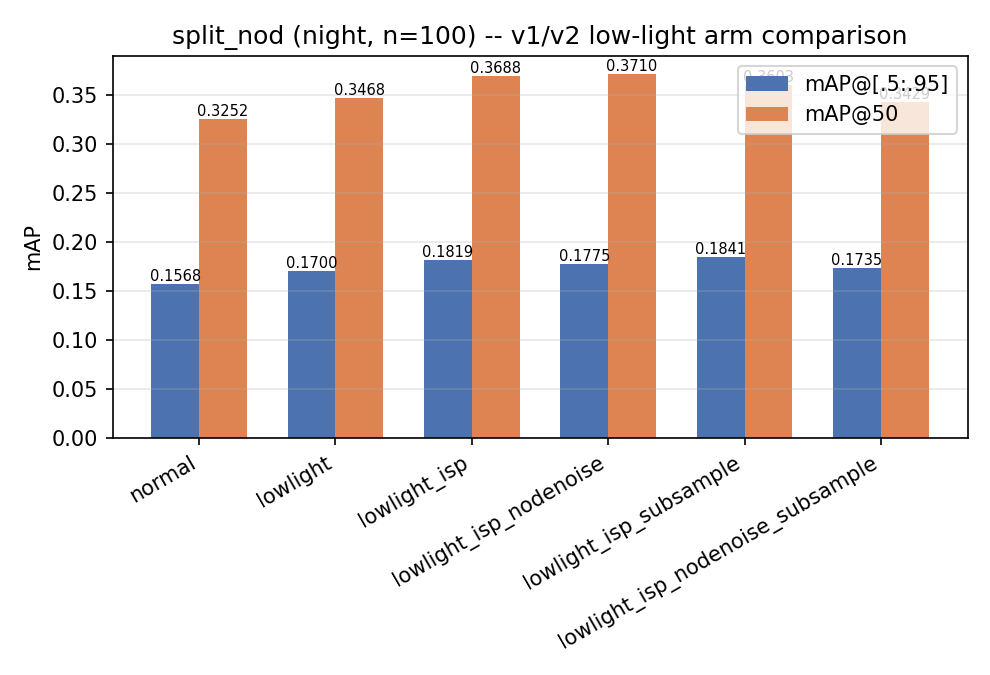
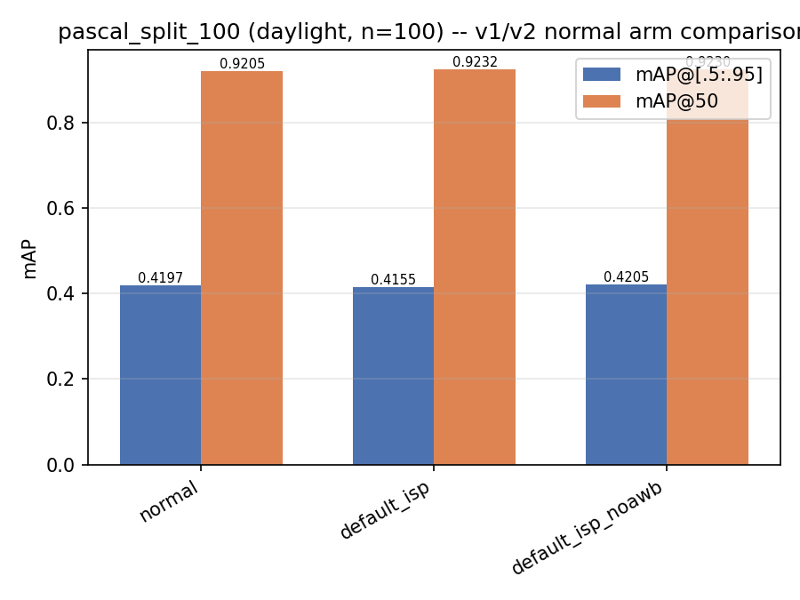
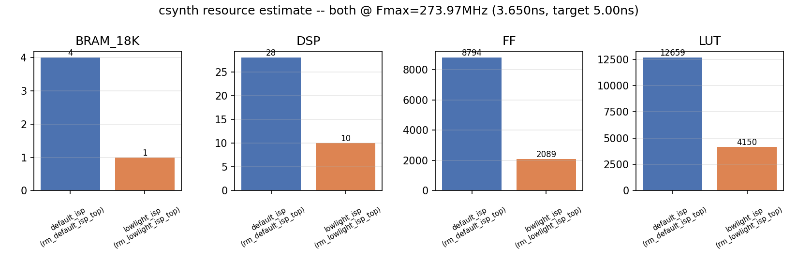

# default_ISP / lowlight_ISP — 정리 리포트 (2026-08-06)

**이 문서는 새로 실행한 결과가 아니다.** `default_isp.cpp`/`lowlight_isp.cpp`는
이미 `~/workspace/dfxisp`의 미병합 워크트리(`hw-interface-prompt`,
`docs/gat-doc-consistency-2026-08-06` 브랜치, main 대비 31커밋 앞섬)에서
Python 미러·HLS csim·csynth·mAP 평가까지 완료돼 있었다. 이 문서는 그 결과를
`dfxisp_v2`로 그대로 가져와 표·그래프로 정리한 것이다. 원본 분석은
`v2-arm-ablation-2026-08-06.md`(이 디렉토리에 함께 복사) 참고.

## 1. 검출 mAP — YOLOv8n, 각 100장

### 1.1 야간 (split_nod)

| arm | mAP@[.5:.95] | mAP@50 |
|---|---:|---:|
| normal (v1) | 0.1568 | 0.3252 |
| lowlight (v1) | 0.1700 | 0.3468 |
| **lowlight_isp (v2, 배포 구성)** | **0.1819** | **0.3688** |
| lowlight_isp_nodenoise | 0.1775 | 0.3710 |
| lowlight_isp_subsample | 0.1841 | 0.3603 |
| lowlight_isp_nodenoise_subsample | 0.1735 | 0.3429 |

### 1.2 주광 (pascal_split_100)

| arm | mAP@[.5:.95] | mAP@50 |
|---|---:|---:|
| normal (v1) | 0.4197 | 0.9205 |
| default_isp (v2) | 0.4155 | 0.9232 |
| default_isp_noawb (v2) | 0.4205 | 0.9230 |

## 2. HLS csynth — 자원/타이밍

두 top 모두 동일 클럭 타깃(5.00ns) 대비 estimated 3.650ns → **Fmax 273.97MHz**.

| top | BRAM_18K | DSP | FF | LUT | latency (max, cycles) |
|---|---:|---:|---:|---:|---:|
| `rm_default_isp_top` | 4 | 28 | 8,794 | 12,659 | 20,736,321 (≈0.104s @5ns) |
| `rm_lowlight_isp_top` | 1 | 10 | 2,089 | 4,150 | 8,294,421 (≈41.5ms @5ns, pipelined) |

lowlight_isp가 default_isp보다 자원이 훨씬 작은 건 denoise 스테이지가 이미
제거된 재합성 버전이기 때문(§3 참고, `74d6be7` 커밋).

## 3. 핵심 결론 (원본 분석 요약)

1. **Denoise는 값어치가 없다** — mAP@[.5:.95] +0.0044, mAP@50 −0.0022로
   지표가 엇갈리고, 출력 픽셀당 27회 비교/선택 비용을 정당화 못함. **제거 권고**
   (실제로 배포 RM에서는 이미 제거됨, csynth 자원 수치가 그 이후 버전).
2. **Same-color binning의 검출 기여는 불확실** — mAP@[.5:.95] −0.0022,
   mAP@50 +0.0085로 지표가 엇갈림.
3. **v2 vs v1: 조건부** — 야간 lowlight_isp는 v1 대비 두 지표 모두 우위
   (+0.0119 / +0.0220). 주광 default_isp는 v1 대비 엇갈림(−0.0042 / +0.0027).
   AWB 기여도 이 100장에서는 입증되지 않음(−0.0050 / +0.0002).
4. 저조도 v2의 야간 이득은 실측됐으나 v1 대비 자원 배증을 정당화하는지는
   별도 판단 필요 — 원본 문서가 이미 명시한 한계.

## 4. 산출물

- `v2-arm-ablation-2026-08-06.md` — 원본 전체 분석 (그대로 복사)
- `map_ablation_nod100_2026-08-06.csv`, `map_ablation_pascal100_2026-08-06.csv` — 원본 CSV
- `rm_default_isp_top_csynth.rpt`, `rm_lowlight_isp_top_csynth.rpt` — 원본 csynth 리포트
- `plot_v2_arm_ablation.py` — 이 문서의 그래프 3장을 생성한 스크립트(신규 작성, 재실행 가능)
- `v2_arm_map_nod100_2026-08-06.png`, `v2_arm_map_pascal100_2026-08-06.png`, `v2_arm_csynth_resource_2026-08-06.png` — 신규 그래프

## 5. 한계

원본 문서(§4)가 명시한 한계가 그대로 적용된다: 100장 단일 YOLOv8n 측정,
반복실행 분산·다른 검출기 교차검증 없음, 화질 지표·denoise 제거 후 HLS
자원 재측정 없음. 이 문서는 표·그래프 재구성만 추가했고 원본 수치를
바꾸지 않았다.
