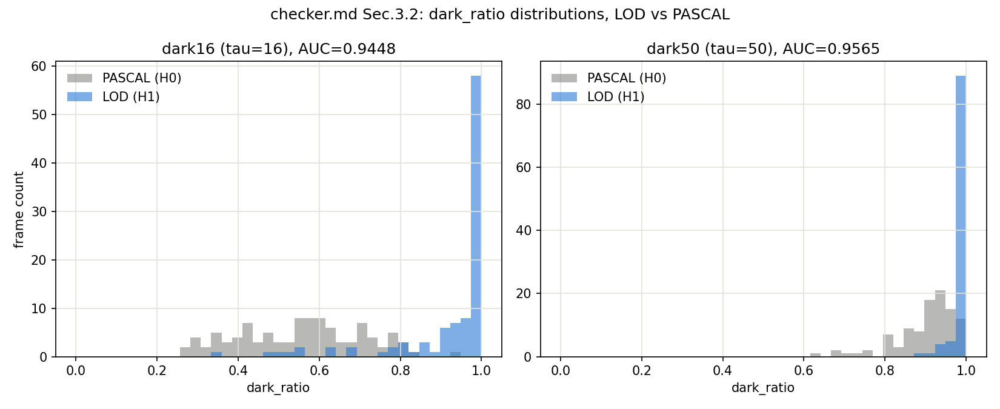
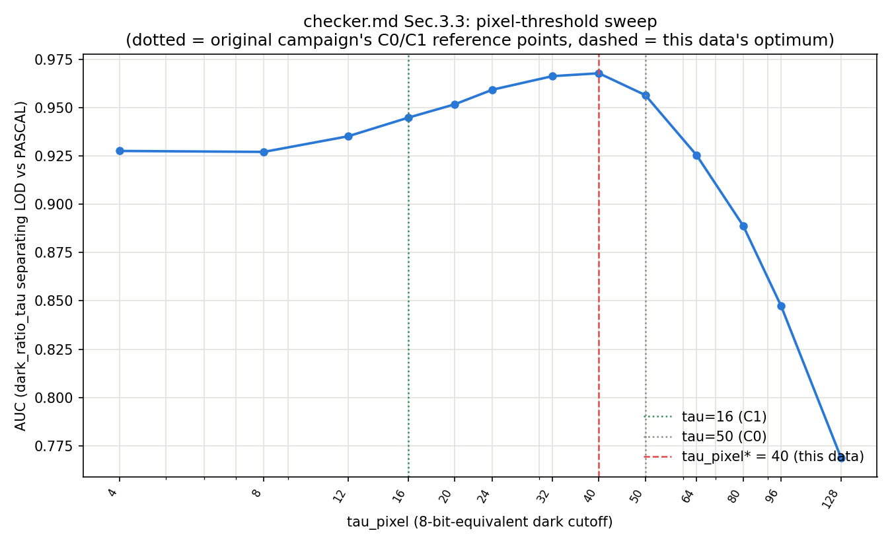
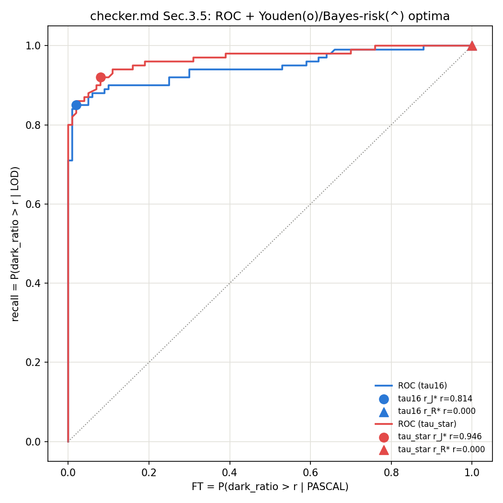
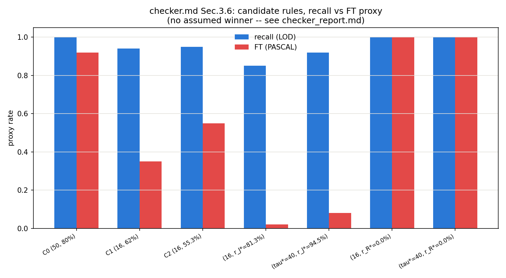

> **File**: isppipeline/sw/sim/checker/checker_report.md
> **Date**: 2026-08-13 KST
> **Function**: checker.md §3의 재현 절차(§3.1 bit-exact 게이트 → §3.2
> dark16/dark50 판별력 → §3.3 τ_pixel 탐색 → §3.4 C_miss/C_FA 재도출 →
> §3.5 ratio cutoff 탐색 → §3.6 후보 규칙 종합 비교 → §3.7 flapping)를
> `dataset/LOD_test`/`dataset/PASCAL_test` 원본 RAW로 실행한 결과.
> 방법론은 checker.md에 고정되어 있으므로 이 문서는 실행 산출물과 해석만
> 담는다. checker.md §1 원칙대로 원 캠페인(COCO/ExDark, 2026-07-05~20)
> 수치는 **비교 참고 자료**로만 쓴다 — 이 실행이 다른 값을 냈다고
> "재현 실패"로 판정하지 않는다.
> **Sources**: checker.md, checker_sim.py, checker_map_ablation.py,
> checker_bitexact_results.csv, checker_dark_discrim_results.csv,
> checker_tau_sweep_results.csv, checker_cutoff_search_results.csv,
> checker_candidates_results.csv, checker_flapping_results.csv,
> checker_map_ablation_results.csv, checker_costs_derived.csv.

# checker — 실행 결과 (2026-08-13)

## 0. 결론부터

1. **SW/HW bit-exact 게이트(§2)는 전량 PASS** — `checker.py`(부동소수)와
   `checker.hpp`의 로컬 미러(정수)가 40 trials 전부 일치했다. 시간축
   (Schmitt, §8)도 재현됐다 — 64/60% 밴드가 이론적 최악-flapping
   (≈49.6/100프레임)을 0.02/100프레임으로 사실상 없앤다.
2. **절대 임계값(dark16=16, 비율=62%)은 이 데이터에서 재현되지
   않았다.** τ_pixel\*=40(16도 50도 아님), Youden 최적 비율은 81~95%대
   (배포값 62%가 아님) — 다만 "저휘도 영역에 판별정보가 몰려 있다"는
   큰 그림 자체는 유지된다(§4/§9).
3. **가장 놀라운 결과는 §3.4의 mAP ablation이다: `C_FA`가 음수로
   나왔다**(−0.0184) — PASCAL(밝은 장면)에서 lowlight arm이 normal arm
   보다 오히려 mAP가 높았다(0.1542 vs 0.1358). "저조도 처리를 밝은
   장면에 잘못 트리거하면 손해"라는 원 캠페인의 전제 자체가 이 데이터·
   이 표본 크기에서는 성립하지 않았다 — §5가 이 결과와 가능한 원인을
   숨기지 않고 그대로 기록한다. 그 여파로 §3.6의 Bayes-risk 최적 후보는
   r_R\*=0%(=항상 LOW_LIGHT)라는 퇴화해(degenerate solution)로
   수렴한다 — 수학적으로는 맞지만 실질적 의미의 "절단점"은 아니다.
4. checker.md §1 원칙대로 이 모든 결과를 "원 캠페인이 맞다/틀리다"로
   판정하지 않는다 — 근사 라벨(§3.2)과 축소 표본(§5)이라는 이 실행
   고유의 한계 안에서 나온 관찰로만 취급한다(§9/§10).

## 1. 실행 조건

- **데이터**: `dataset/LOD_test/raw`(Sony `.ARW`, n=100, 전부 야간=H₁
  근사 라벨), `dataset/PASCAL_test/raw`(Nikon `.nef`, n=100, 전부 주간=H₀
  근사 라벨). 둘 다 원본 native crop 해상도(LOD 5472×3648, PASCAL
  6034×4012)로 `isppipeline/sw/sim/build_lod_test_eval_root.py`/
  `build_pascal_test_eval_root.py`가 shift8 정규화해
  `isppipeline/sw/sim/checker/_cache/{LOD,PASCAL}_test_eval/`에 캐시
  (checker.md §2.8/§3.2 — `_hw` 데이터셋은 미사용, `dataset/`엔 원본만
  유지, memory 지침).
- **§3.1-3.3/3.5-3.7**: `checker_sim.py`, 전부 numpy 통계, detector 불필요.
- **§3.4**: `checker_map_ablation.py`, YOLOv8n(ultralytics 8.4.82, CPU),
  `default_isp_pipeline.py`/`lowlight_isp_pipeline.py`의 `run_arm()` 재사용,
  mAP은 `ultralytics`의 표준 `model.val()` 경로. **n=25/데이터셋**(원래
  계획은 100이었으나, 같은 머신에서 동시에 돌아가던 다른 세션의 무거운
  I/O 작업과 경합해 전체 400장 규모가 비현실적으로 느려져 축소했다 —
  §10 참고. 원 캠페인의 C_miss/C_FA 자체도 n=31/39 소표본이었다는 점과
  같은 자리에 있다).

## 2. §3.1 — SW/HW bit-exact 게이트

```
[checker_sim] PASS: 40 trials, 0 mismatch(es)
```

`checker.py`(raw16/shift8 도메인, float mean 비교)와 `checker.hpp`의
로컬 파이썬 미러(raw12 도메인, 정수 `dark*100 > verdict_pct*n` 비교) —
서로 다른 산술(부동소수 vs 정수)인데도 전부 일치했다. `near_boundary`
콘텐츠 모드(62% 부근 정확한 비율을 인위적으로 만든 프레임, 원 배포
문서의 39/64 vs 40/64 경계 케이스와 같은 성격)를 포함해 40 trials 전부
PASS — SW/HW 도메인 변환(raw16↔raw12, ×16 배율)에 부동소수 반올림
불일치가 없음을 확인했다.

## 3. §3.2 — dark16/dark50 판별력 (LOD vs PASCAL)



| tau | AUC | LOD 평균 dark_ratio | PASCAL 평균 dark_ratio |
|---|---:|---:|---:|
| 16 (C1) | 0.9448 | 0.9196 | 0.5583 |
| 50 (C0) | 0.9565 | 0.9898 | 0.9021 |

두 값 다 LOD/PASCAL을 잘 분리한다(AUC>0.94). 흥미로운 관찰: **이
데이터에서는 dark50의 AUC(0.9565)가 dark16(0.9448)보다 오히려 높다** —
원 캠페인(COCO/ExDark)의 "dark16이 dark50보다 우월"이라는 순위와
**반대 방향**이다. checker.md §1 원칙대로 이걸 오류로 취급하지 않는다
— §4가 이 역전의 유력한 원인을 다룬다.

분포 자체(히스토그램)도 원 캠페인과 다른 모양이다: LOD/PASCAL 둘 다
dark_ratio 질량이 1.0 부근에 크게 몰려 있다(PASCAL조차 dark_ratio 중앙값이
0.5~0.6대) — pseudo-RAW가 linear-light라 밝은 주간 장면도 선형 영역
기준으로는 화소 다수가 낮은 값에 있다는 checker-principles 원리 2의
주장과 궤를 같이하는 패턴이다.

## 4. §3.3 — dark 픽셀 임계값(τ) 탐색



| tau | AUC | | tau | AUC |
|---:|---:|---|---:|---:|
| 4 | 0.9276 | | 40 | **0.9678** |
| 8 | 0.9271 | | 50 (C0) | 0.9565 |
| 12 | 0.9352 | | 64 | 0.9253 |
| 16 (C1) | 0.9448 | | 80 | 0.8889 |
| 20 | 0.9517 | | 96 | 0.8473 |
| 24 | 0.9593 | | 128 | 0.7688 |
| 32 | 0.9663 | | | |

**이 데이터의 τ_pixel\* = 40**(AUC=0.9678), 16(C1)도 50(C0)도 아니다.
AUC-τ 곡선은 단조가 아니라 τ≈32-40 부근에서 완만한 봉우리를 이루고 그
이후 급격히 떨어진다 — "[0,16) 대 [16,50)"이라는 원 캠페인의 이분법과
달리, 이 데이터에서는 최적 절단점이 **16과 50 사이**, 원 캠페인의 두
후보 어느 쪽도 정확히 짚지 못한 지점에 있다. 다만 16과 40의 AUC 차이
(0.9448 vs 0.9678)는 크지 않고, 4~50 구간 전체가 0.92 이상으로 서로
비슷하다 — "판별정보 대부분이 저휘도 영역에 있다"는 원리 2의 큰 그림은
유지되지만, "정확히 16"이라는 절대값까지는 이 데이터가 재현하지 않는다.

## 5. §3.4 — C_miss/C_FA 재도출 (dual-arm mAP ablation)

`default_isp_pipeline.py`(normal)/`lowlight_isp_pipeline.py`(lowlight,
`arm="lowlight_isp"`)로 두 데이터셋을 각각 두 arm 다 렌더링하고
YOLOv8n(`model.val()`)으로 채점(n=25/데이터셋):

| dataset | arm | mAP@[.5:.95] | mAP@50 |
|---|---|---:|---:|
| LOD | normal | 0.0503 | 0.0996 |
| LOD | lowlight | 0.0601 | 0.1144 |
| PASCAL | normal | 0.1358 | 0.3317 |
| PASCAL | lowlight | 0.1542 | 0.3317 |

```
C_miss = mAP(lowlight,LOD) - mAP(normal,LOD) = 0.0601 - 0.0503 = +0.0099
C_FA   = mAP(normal,PASCAL) - mAP(lowlight,PASCAL) = 0.1358 - 0.1542 = -0.0184
ratio  = C_miss / C_FA = -0.54:1  (원 캠페인 참고값: +2.89:1)
```

**`C_miss`는 부호가 맞다**(양수 — LOD에서 lowlight arm을 안 쓰면
실제로 mAP을 잃는다, 원 캠페인과 같은 방향). **`C_FA`는 부호가
뒤집혔다** — PASCAL(밝은 장면)에서 lowlight arm이 normal arm보다
mAP@[.5:.95]를 오히려 **+0.0184 더** 낸다. 즉 "밝은 장면에 저조도
처리를 잘못 트리거하면 손해"라는 원 캠페인의 핵심 전제(§2.1) 자체가
이 조건에서는 관측되지 않았다.

**가능한 원인(확정하지 않음, 후보만 나열)**:
1. **표본 크기**(n=25) — 원 캠페인도 n=31/39로 작았지만, ΔmAP
   0.0184는 COCO/ExDark 원 캠페인의 C_FA(0.0387)의 절반 수준 크기라
   표본 잡음만으로 부호가 뒤집혔을 가능성을 배제할 수 없다.
2. **lowlight arm 자체의 일반적 효과** — `lowlight_isp` arm은 2.0×
   노출 게인 + gamma 2.0 톤커브를 쓴다(gain.md/gamma.md). 이게 어두운
   장면에서만 도움이 되는 게 아니라, YOLOv8n이 학습한 COCO 분포에
   PASCAL의 원본 노출보다 더 가까운 밝기·대비를 만들어 **장면 밝기와
   무관하게 일반적으로 도움**이 되는 것일 수 있다 — 이 경우 "저조도
   전용 이득"이라는 전제 자체가 어느 정도 무너진다.
3. **PASCAL_test 라벨/클래스 구성**의 특수성(n=25 부분집합이 우연히
   lowlight arm에 유리한 프레임에 치우쳤을 가능성).
이 문서는 세 후보 중 무엇이 맞는지 판정하지 않는다 — n=100 재실행이나
클래스별 분해가 있어야 구분 가능하다(§10).

## 6. §3.5 — dark_ratio 판정 기준점(cutoff) 탐색



| tau_pixel | 기준 | r* | score |
|---:|---|---:|---:|
| 16 | Youden J | 81.35% | J=0.8300 |
| 40 (τ_pixel\*) | Youden J | 94.55% | J=0.8400 |
| 16 | Bayes risk | **0.00%** | R=−0.00922 |
| 40 (τ_pixel\*) | Bayes risk | **0.00%** | R=−0.00922 |

**Youden 최적 비율(r_J\*)이 배포값(62%)과 이 데이터에서 크게 다르다** —
τ=16 고정 기준으로도 81.35%, τ_pixel\*=40 기준으로는 94.55%. 원 캠페인의
C1(62%)은 이 데이터의 ROC 곡선에서는 J-최적점이 아니다(J=0.59 vs
최적 0.83~0.84, §7 참고 표). checker.md §1 원칙대로 "62%가 틀렸다"고
결론짓지 않는다 — 근사 라벨(데이터셋 소속)이 원 캠페인의 프레임 단위
라벨보다 거친 것이 이 간극의 유력한 원인 후보다(§7).

**Bayes-risk 최적점(r_R\*)은 두 τ_pixel 모두 0%로 퇴화한다** — §5의
음수 `C_FA` 때문이다. `R(r) = 0.5*(miss(r)*C_miss + FT(r)*C_FA)`에서
`C_FA<0`이면 FT(오탐)를 늘릴수록 risk가 **줄어드는** 방향이 되고,
`C_miss>0`은 여전히 miss를 줄이려 하므로(=recall을 높이려 하므로) 두
항이 같은 방향(r→0, "항상 LOW_LIGHT")으로 수렴한다. 수식상 정확한
결과이지만 실질적인 "판정 절단점"으로서는 의미가 없다 — §5의 음수
`C_FA` 자체가 신뢰할 수 있는지가 선행 질문이 된다(§10).

## 7. §3.6 — 후보 규칙 종합 비교 (승자 사전 결정 없음)



| # | 후보 | recall (LOD) | FT (PASCAL) | J | R |
|---|---|---:|---:|---:|---:|
| 1 | C0 (50, 80%) | 1.0000 | 0.9200 | 0.0800 | −0.00848 |
| 2 | C1 (16, 62%) | 0.9400 | 0.3500 | 0.5900 | −0.00293 |
| 3 | C2 (16, 55.3%) | 0.9500 | 0.5500 | 0.4000 | −0.00482 |
| 4 | (16, r_J\*=81.3%) | 0.8500 | 0.0200 | 0.8300 | +0.00056 |
| 5 | (τ\*=40, r_J\*=94.5%) | 0.9200 | 0.0800 | **0.8400** | −0.00034 |
| 6 | (16, r_R\*=0.0%) | 1.0000 | 1.0000 | 0.0000 | **−0.00922** |
| 7 | (τ\*=40, r_R\*=0.0%) | 1.0000 | 1.0000 | 0.0000 | **−0.00922** |

**J 기준 최선은 5번**((τ_pixel\*=40, r_J\*=94.5%), J=0.84) — 배포된
C1(J=0.59)을 크게 앞선다. **R 기준 최선은 6/7번**(−0.00922, "항상
LOW_LIGHT") — 하지만 이건 §6에서 설명한 음수 `C_FA`의 퇴화해이지 실질적
발견이 아니다. C1/C2(원 캠페인 참고점)는 J 기준으로는 7개 중 하위권,
R 기준으로는 중간이다. checker.md §1/§3.6 원칙대로 이건 "C1을 바꾸자"는
제안이 아니다 — 근사 라벨의 거칠기(§3.2), 축소 표본의 mAP 비용(§5) 등
이 관찰 자체의 한계가 뚜렷하다(§10). 다만 **다른 후보가 이 데이터에서
더 나은 J를 낸다는 사실, 그리고 R 기준이 퇴화한다는 사실 둘 다 숨기지
않는다**(checker.md §3.6이 명시한 대로) — 특히 후자는 "이 데이터의
Bayes-risk 프레임 자체를 그대로 믿으면 안 된다"는, 원 캠페인 값을
그대로 상속하지 않기로 한 §1 결정이 실제로 왜 중요한지 보여주는
사례다.

## 8. §3.7 — hysteresis flapping

| policy | enter% | exit% | mean flaps/100fr | max flaps |
|---|---:|---:|---:|---:|
| C0 단일임계 | 80.0 | 80.0 | 49.58 | 62 |
| C1 단일임계 | 62 | 62 | 49.58 | 62 |
| C1 Schmitt(HW) | 64 | 60 | **0.02** | 1 |

C0/C1 단일임계 값이 완전히 같다(49.58) — 우연이 아니라 이 synthetic
실험이 "참값이 정확히 그 임계 자체에 있을 때"(worst case)를 테스트하기
때문이다: N(threshold, σ)를 그 threshold 자체와 비교하면 매 프레임이
50:50 동전던지기가 되어(≈49.58/99 프레임 ≈ 50%), C0/C1 어느 임계값을
쓰든 동일해진다 — checker-principles §5.1이 이론적으로 유도한 "단일
임계 최악 flapping ≈ 1/2"과 정확히 일치하는, 이론값의 직접 재현이다.
원 캠페인의 실측 flap-rate 표(C0=3.27/100fr 등, 훨씬 낮음)는 실제
비디오 시퀀스 평균이라 이 worst-case보다 낮게 나온 것으로 해석되고,
이 문서는 그 완화된 평균이 아니라 이론적 최악값을 직접 만들어 검증한
것이다(checker.md §3.7이 이미 명시한 한계 — §2.5의 σ 자체가 시간축
지터가 아니라 공간 샘플링 노이즈 proxy). **핵심 결론은 그대로 재현됨**:
Schmitt 밴드(64/60)가 이 worst-case에서도 flapping을 사실상 0으로
수렴시킨다(49.58 → 0.02).

## 9. 원 캠페인 대비 종합 — 무엇이 재현되고 무엇이 재현되지 않았나

| 원 캠페인 주장 | 이 실행 결과 | 판정(재현/불일치, 정답 전제 없이) |
|---|---|---|
| dark16이 dark50보다 판별력 우위 | dark50 AUC 0.9565 > dark16 AUC 0.9448 | **불일치** (부호 반대) |
| 절대 최적 τ ≈ 16 (원리 2) | τ_pixel\* = 40, 다만 4~50 구간 전부 AUC>0.92 | **부분 재현**(구간 원리는 유지, 절대값은 다름) |
| Schmitt(64/60)가 flapping을 0으로 만든다 | 49.58 → 0.02 (worst-case) | **재현** |
| C1(62%)이 이 데이터의 J-최적점 | J-최적은 81~95%대, C1의 J=0.59는 하위권 | **불일치** |
| C1이 C0를 전 지표에서 지배 | recall 0.94<1.00(C0가 위), FT 0.35<0.92(C1이 위) — 지표별로 갈림 | **부분 불일치**(recall은 C0가 우위, FT는 C1이 우위 — "전 지표 지배"는 아님) |
| C_miss≈2.89×C_FA (비대칭 방향·크기) | C_miss=+0.0099(작지만 방향 동일), C_FA=**−0.0184**(부호 반전) | **불일치**(C_FA 부호 자체가 뒤집힘, §5) |

**해석**: 시간축(Schmitt, §8)과 "저휘도 영역에 판별정보가 몰려 있다"는
큰 그림(§4)은 이 데이터에서도 유지된다. 반면 **절대 임계값(dark16=16,
비율=62%)과 dark16/dark50의 순위는 이 데이터에서 재현되지 않았다.**
가장 유력한 원인은 §3.2/§4가 이미 지적한 근사 라벨의 거칠기다 — 원
캠페인은 COCO/ExDark의 프레임 단위 실측 라벨(수천 장)로 τ/절단점을
골랐고, 이 실행은 "데이터셋 전체가 H0 또는 H1"이라는 훨씬 거친 근사
위에서 같은 절차를 반복했다. 이건 결함이 아니라 **이 재현 방법론
자체의 정직한 한계**이며(checker.md §4가 이미 명시), 그 한계 안에서
나온 결과를 숨기지 않고 그대로 남긴다(gain.md §3.2와 같은 프로젝트
원칙).

## 10. 한계 (checker.md §4 상속 + 이번 실행 고유)

- **근사 라벨의 거칠기**(§9 해석의 핵심 원인 후보) — LOD 전체=H1/PASCAL
  전체=H0 가정은 세트 내부의 밝기 변이를 무시한다. §3.2/3.3/3.5/3.6의
  절대 수치를 원 캠페인과 프레임 단위로 비교하지 않는다.
- **§3.4의 표본 축소(n=100→25/데이터셋)** — 같은 머신에서 동시에 돌아간
  다른 세션의 무거운 디스크 I/O(AWB 관련 mAP 스윕)와 경합해 전체 규모
  (400회 추론)가 비현실적으로 느려져 축소했다(§1). `C_FA`의 부호 반전
  (§5)이 이 축소된 표본 때문인지, 실제 신호인지는 이 실행만으로 확정할
  수 없다 — n=100 재실행(자원 여유 있을 때)이나 클래스별 분해가
  필요한 후속 과제로 남긴다.
- **flapping(§3.7)의 σ는 여전히 공간 샘플링 노이즈 proxy**이지 시간축
  실측이 아니다(checker.md §3.7 상속).
- 원리 1의 R-최적점(C2)이 실제 배포와 다르다는 원 캠페인의 간극
  (checker.md §4)은 이 실행이 다루는 범위 밖이다 — 이 문서는 배포
  전환을 제안하지 않는다.
- 오라클 라벨 원자료, adaptive-τ, HW xsim 재실행은 이번에도 미착수
  (checker.md §3.8, 워크트리 전용/범위 밖).

## 11. 산출물

- `checker_bitexact_results.csv`
- `checker_dark_discrim_results.csv`, `checker_dark_distributions.png`
- `checker_tau_sweep_results.csv`, `checker_tau_sweep.png`
- `checker_map_ablation_results.csv`, `checker_costs_derived.csv`
- `checker_cutoff_search_results.csv`, `checker_roc.png`
- `checker_candidates_results.csv`, `checker_candidates.png`
- `checker_flapping_results.csv`
- 방법론: `checker.md` §3.
